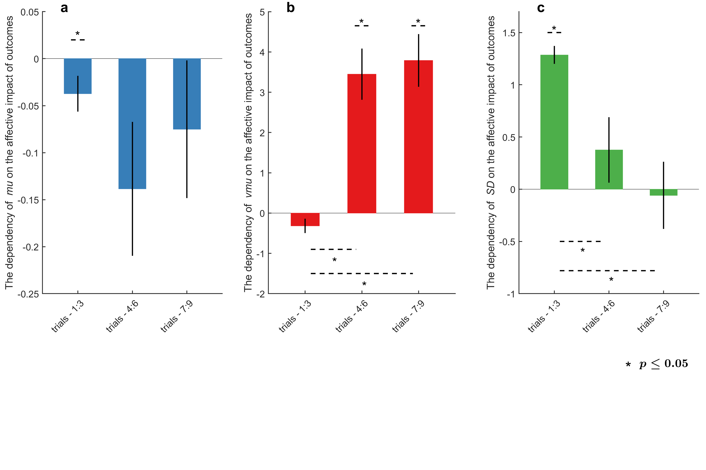
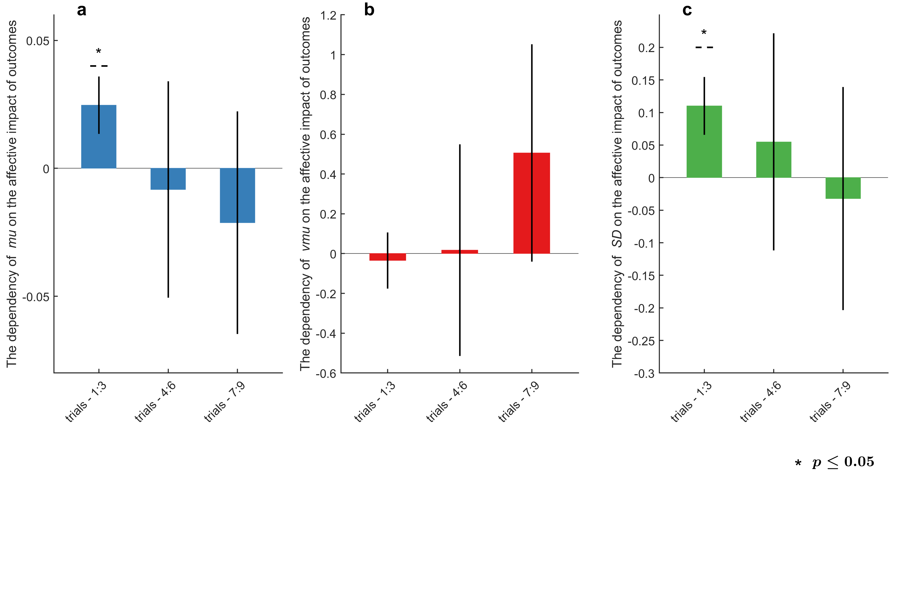

#library 
```{r}
source(here::here("load_library.R"))
```

```{r}
theme_set(theme_classic()+
          theme(text = element_text(family = "Helvetica", size = 10)))
vmuColor <- "red"
noiseColor <- 'royalblue3'
muColor <- 'forestgreen'
```

#load and combine data
```{r}
rmarkdown::render("read_data.Rmd")
```

# part 1: Linking task and EMA mood variability

## 1.1 simulation demonstrating the plausibility of inferring long-term affective variability from task variability


## 1.2 dependency of gorilla task parameters on emotional reactivity



## 1.3 dependency of EMA params on task params

```{r fig.width= 12, fig.height=4}
ggplot(df_master, aes(x = mean5_vmu, y = mean5_vmu_posminusneg))+
  geom_point(size = 0.5)+
  geom_smooth(method = "lm", color = vmuColor, fill = vmuColor) +
  stat_poly_eq(use_label(c("R2","p")))+
  labs(title ="dependency of task parames on EMA params",
       x = "task volatility",
       y = "EMA volatility")+
ggplot(df_master, aes(x = mean_mu, y = mean_mu_posminusneg))+
  geom_point(size = 0.5)+
  geom_smooth(method = "lm", color = muColor, fill = muColor) +
  stat_poly_eq(use_label(c("R2","p")))+
  labs(x = "task mean",
       y = "EMA mean")+
ggplot(df_master, aes(x = mean_s, y = mean_s_posminusneg))+
  geom_point(size = 0.5)+
  geom_smooth(method = "lm", color = noiseColor, fill = noiseColor) +
  stat_poly_eq(use_label(c("R2","p")))+
  labs(x = "task noise",
       y = "EMA noise")
```

```{r}
summary(lm(mean5_vmu ~ mean5_vmu_posminusneg + mean_mu + mean_s, df_master))

summary(lm(mean_mu ~ mean_mu_posminusneg + mean5_vmu + mean_s, df_master))

summary(lm(mean_s ~ mean_s_posminusneg + mean_mu + mean5_vmu, df_master))
```


# part 2: Relationship between EMA and baseline questionnaires
## EMA summary statistics and baseline questionnaires (gist: everything is intercorrelated; poor differentiation between mean and se)
### We used PA minus NA because it's most comparative with the analog scale
```{r}
chart.Correlation(df_master %>% 
                    dplyr::select(TEPS_sum,HPS_sum,CESD_sum,STAI_SA_sum,STAI_TA_sum,
                           PA_mean,PA_se,NA_mean,NA_se))
```

## EMA bayes params and baseline questionnaires
*Ask Mike here: how to justify using posminusneg vs. pos and neg separately?*

### When using the difference score (PA minus NA), we see that the noise of this 'net mood rating' is correlated with HPS
```{r}
chart.Correlation(df_master %>% 
                    dplyr::select(TEPS_sum,HPS_sum,CESD_sum, STAI_TA_sum,STAI_TA_sum,
                           mean5_vmu_posminusneg,mean_mu_posminusneg,mean_s_posminusneg))
```

* Check with Mike about how to interpret this!*

```{r fig.width= 15, fig.height=4}
ggplot(df_master, aes(x = TEPS_sum, y = mean5_vmu))+
  geom_point(size = 0.5)+
  geom_smooth(method = "lm", fill = 'grey', color = 'grey') +
  stat_poly_eq(use_label(c("R2","p")))+
  labs(y = "task mood volatility")+
ggplot(df_master, aes(x = TEPS_sum, y = mean_s))+
  geom_point(size = 0.5)+
  geom_smooth(method = "lm", color = noiseColor, fill = noiseColor) +
  stat_poly_eq(use_label(c("R2","p")))+
  labs(y = "task mood noise")+
ggplot(df_master, aes(x = HPS_sum, y = mean5_vmu))+
  geom_point(size = 0.5)+
  geom_smooth(method = "lm", fill = 'grey', color = 'grey') +
  stat_poly_eq(use_label(c("R2","p")))+
  labs(y = "task mood volatility")+
ggplot(df_master, aes(x = HPS_sum, y = mean_s))+
  geom_point(size = 0.5)+
  geom_smooth(method = "lm", fill = 'grey', color = 'grey') +
  stat_poly_eq(use_label(c("R2","p"))) +
  plot_layout(nrow = 1)
  labs(y = "task mood noise")
  
summary(lm(TEPS_sum ~ mean_s + mean5_vmu + mean_s_pos +mean5_vmu_pos,df_master))
ppcor::pcor(df_master %>% dplyr::select(mean_s,mean5_vmu_pos,TEPS_sum))

summary(lm(HPS_sum ~ mean_s + mean5_vmu + mean_s_pos + mean5_vmu_pos,df_master))
```

### However, we would expect some differentiation between PA and NA parameters; TEPS should be correlated with PA variability., and depression/anxiety should be correlated with NA variability. Motivated by this differentiability, we will now examine these specific links.

```{r fig.width= 12,fig.height= 8}
ppcor::pcor(df_master %>% dplyr::select(HPS_sum,mean5_vmu_pos,TEPS_sum))
ppcor::pcor(df_master %>% dplyr::select(HPS_sum,mean_s_pos,TEPS_sum))
ppcor::pcor(df_master %>% dplyr::select(HPS_sum,mean5_vmu_neg,TEPS_sum))
ppcor::pcor(df_master %>% dplyr::select(HPS_sum,mean_s_neg,TEPS_sum))

ggplot(df_master, aes(x = TEPS_sum, y = mean5_vmu_pos))+
  geom_point(size = 0.5)+
  geom_smooth(method = "lm", fill = vmuColor, color = vmuColor) +
  stat_poly_eq(use_label(c("R2","p")))+
  labs(title = "TEPS",
       y = "PA vmu",
       subtitle = "partial r = 0.156, p = .004")+
ggplot(df_master, aes(x = TEPS_sum, y = mean_s_pos))+
  geom_point(size = 0.5)+
  geom_smooth(method = "lm", fill = 'grey', color = 'grey') +
  stat_poly_eq(use_label(c("R2","p")))+
  labs(y = "PA noise",
       subtitle = "partial r = -0.028, p = .608")+
ggplot(df_master, aes(x = TEPS_sum, y = mean5_vmu_neg))+
  geom_point(size = 0.5)+
  geom_smooth(method = "lm", fill = 'grey', color = 'grey', linetype = "dashed") +
  stat_poly_eq(use_label(c("R2","p")))+
  labs(y = "NA vmu",
       subtitle = "partial r = -0.091, p = .093")+
ggplot(df_master, aes(x = TEPS_sum, y = mean_s_neg))+
  geom_point(size = 0.5)+
  geom_smooth(method = "lm", fill = 'grey', color = 'grey', linetype = "dashed") +
  stat_poly_eq(use_label(c("R2","p")))+
  labs(y = "NA noise",
       subtitle = "partial r = -0.109, p = .045") + 
ggplot(df_master, aes(x = HPS_sum, y = mean5_vmu_pos))+
  geom_point(size = 0.5)+
  geom_smooth(method = "lm", fill = 'grey', color = 'grey') +
  stat_poly_eq(use_label(c("R2","p")))+
  labs(title = "HPS",y = "PA vmu",
       subtitle = "partial r = 0.064, p = .240")+
ggplot(df_master, aes(x = HPS_sum, y = mean_s_pos))+
  geom_point(size = 0.5)+
  geom_smooth(method = "lm", fill = 'grey', color = 'grey') +
  stat_poly_eq(use_label(c("R2","p")))+
  labs(y = "PA noise",
       subtitle = "partial r = 0.092, p = .091")+
ggplot(df_master, aes(x = HPS_sum, y = mean5_vmu_neg))+
  geom_point(size = 0.5)+
  geom_smooth(method = "lm", color = vmuColor, fill = vmuColor, linetype = "dashed") +
  stat_poly_eq(use_label(c("R2","p")))+
  labs(y = "NA vmu",
       subtitle = "partial r = 0.118, p = .029")+
ggplot(df_master, aes(x = HPS_sum, y = mean_s_neg))+
  geom_point(size = 0.5)+
  geom_smooth(method = "lm", color = noiseColor, fill = noiseColor, linetype = "dashed") +
  stat_poly_eq(use_label(c("R2","p")))+
  labs(y = "NA noise",
       subtitle = "partial r = 0.298, p < .001")+
  plot_layout(nrow = 2)

```

## do a factor analysis of all baseline questionnaires to capture positive and negative affectivity
```{r}
df_fa <- df_master %>% dplyr::select(HPS_sum,TEPS_ant_sum,TEPS_con_sum,CESD_sum, STAI_TA_sum,STAI_SA_sum)

ev <- eigen(cor(na.omit(df_fa))) # get eigenvalues
ap <- parallel(subject=nrow(df_fa),var=ncol(df_fa),rep=100,cent=.05)
nS <- nScree(x=ev$values, aparallel=ap$eigen$qevpea)
plotnScree(nS)# scree plot

psych::fa(df_fa, nfactors = 2,
          rotate = "varimax",
          scores = "regression")

df_master_ <- cbind(df_master, psych::fa(df_fa, nfactors = 2,
          rotate = "varimax",
          scores = "regression")$scores) %>% 
  rename(trait_NA = MR1,
         trait_PA= MR2)
```

```{r fig.width= 12,fig.height= 8}
ggplot(df_master_, aes(x = trait_NA, y = mean5_vmu_pos))+
  geom_point(size = 0.5)+
  geom_smooth(method = "lm", fill = 'grey', color = 'grey') +
  stat_poly_eq(use_label(c("R2","p")))+
  labs(title = "EMA variability and Trait NA",
       y = "PA vmu")+
ggplot(df_master_, aes(x = trait_NA, y = mean_s_pos))+
  geom_point(size = 0.5)+
  geom_smooth(method = "lm", fill = 'grey', color = 'grey') +
  stat_poly_eq(use_label(c("R2","p")))+
  labs(y = "PA noise")+
ggplot(df_master_, aes(x = trait_NA, y = mean5_vmu_neg))+
  geom_point(size = 0.5)+
  geom_smooth(method = "lm", color = vmuColor, fill = vmuColor, linetype = "dashed") +
  stat_poly_eq(use_label(c("R2","p")))+
  labs(y = "NA vmu")+
ggplot(df_master_, aes(x = trait_NA, y = mean_s_neg))+
  geom_point(size = 0.5)+
  geom_smooth(method = "lm", color = noiseColor, fill = noiseColor, linetype = "dashed") +
  stat_poly_eq(use_label(c("R2","p")))+
  labs(y = "NA noise")+

ggplot(df_master_, aes(x = trait_PA, y = mean5_vmu_pos))+
  geom_point(size = 0.5)+
  geom_smooth(method = "lm", color = vmuColor, fill = vmuColor) +
  stat_poly_eq(use_label(c("R2","p")))+
  labs(title = "EMA variability and Trait PA",y = "PA vmu")+
ggplot(df_master_, aes(x = trait_PA, y = mean_s_pos))+
  geom_point(size = 0.5)+
  geom_smooth(method = "lm", fill = 'grey', color = 'grey') +
  stat_poly_eq(use_label(c("R2","p")))+
  labs(y = "PA noise")+
ggplot(df_master_, aes(x = trait_PA, y = mean5_vmu_neg))+
  geom_point(size = 0.5)+
  geom_smooth(method = "lm", fill = 'grey', color = 'grey', linetype = "dashed") +
  stat_poly_eq(use_label(c("R2","p")))+
  labs(y = "NA vmu")+
ggplot(df_master_, aes(x = trait_PA, y = mean_s_neg))+
  geom_point(size = 0.5)+
  geom_smooth(method = "lm", fill = 'grey', color = 'grey', linetype = "dashed") +
  stat_poly_eq(use_label(c("R2","p")))+
  labs(y = "NA noise")+

  plot_layout(nrow = 2)
```

# Part 3: diurnal contributions to the EMA variability
```{r warning=FALSE,message=FALSE}
source(here::here("fit_diurnal_model.R"))
```
## plot example diurnal fit
```{r}
lm_diurn_pa <- lmer(PA_sum_scaled ~ I(time_index^2) + time_index +(1|day_index/Prolific.Id),data=df_PANAS_forlm)

summary(lm_diurn_pa)

df_PANAS_forlm1 <- df_PANAS_forlm %>%
  filter(!is.na(PA_sum_scaled)) 
df_PANAS_forlm1$PA_pred_val = fitted(lm_diurn_pa)

ggplot(data=df_PANAS_forlm1)+
    theme_classic()+
    stat_summary(aes(x=time_index, y=PA_pred_val,group = Prolific.Id), 
                 geom = "line", alpha = 0.1)+
  stat_summary(aes(x=time_index, y=PA_pred_val,group = 1), 
                 geom = "pointrange", color = "red", size = 0.5)+
    labs(title = 'Diurnal Variation Model prediction - PA',
         y = 'predicted scaled PA', x = 'time of day')+
   scale_x_continuous(breaks = 1:6, labels = c("9-11AM","11AM-1PM","1-3PM","3-5PM","5-7PM","7-9PM"))
```

```{r}
lm_diurn_na <- lmer(NA_sum_scaled ~ I(time_index^2) + time_index +(1|day_index/Prolific.Id),data=df_PANAS_forlm)

summary(lm_diurn_na)

df_PANAS_forlm2 <- df_PANAS_forlm %>%
  filter(!is.na(NA_sum_scaled)) 
df_PANAS_forlm2$NA_pred_val = fitted(lm_diurn_na)

ggplot(data=df_PANAS_forlm2)+
    theme_classic()+
    stat_summary(aes(x=time_index, y=NA_pred_val,group = Prolific.Id), 
                 geom = "line", alpha = 0.1)+
  stat_summary(aes(x=time_index, y=NA_pred_val,group = 1), 
                 geom = "pointrange", color = "red", size = 0.5)+
    labs(title = 'Diurnal Variation Model prediction - NA',
         y = 'predicted scaled NA', x = 'time of day')+
   scale_x_continuous(breaks = 1:6, labels = c("9-11AM","11AM-1PM","1-3PM","3-5PM","5-7PM","7-9PM"))
```

## demonstrate that diurnal variation contributes to noise
```{r}
df_lm_sum <- read_csv(paste(outdir, 'panas_lm_params.csv'))

df_master <- left_join(df_master, df_lm_sum %>% 
  dplyr::select(Prolific.Id,model,Intercept_Estimate:t_Estimate,R2c) %>% 
  pivot_wider(names_from = model, values_from = c(Intercept_Estimate:R2c)))


ggplot(df_master %>% 
         dplyr::select(`t^2_Estimate_PA`,`t^2_Estimate_NA`) %>% 
         rename(PosAff = `t^2_Estimate_PA`,
                NegAff = `t^2_Estimate_NA`) %>% 
         pivot_longer(PosAff:NegAff,
                      names_to = "Affect", values_to = "quad_term"), aes(x = Affect, y = quad_term))+
  geom_violin(aes(color = Affect))+
  geom_jitter(width = 0.3, size = 0.4)+
  stat_summary(aes(color = Affect),geom = "pointrange")+
  scale_color_brewer(palette = "Set1")+
  geom_hline(yintercept = 0, linetype = "dotted")

t.test(df_master$`t^2_Estimate_PA`, mu = 0)
t.test(df_master$`t^2_Estimate_NA`, mu = 0)

ggplot(df_master %>% 
         dplyr::select(`t_Estimate_PA`,`t_Estimate_NA`) %>% 
         rename(PosAff = `t_Estimate_PA`,
                NegAff = `t_Estimate_NA`) %>% 
         pivot_longer(PosAff:NegAff,
                      names_to = "Affect", values_to = "lin_term"), aes(x = Affect, y = lin_term))+
  geom_violin(aes(color = Affect))+
  geom_jitter(width = 0.3,size=0.4)+
  stat_summary(aes(color = Affect),geom = "pointrange")+
  scale_color_brewer(palette = "Set1")+
  geom_hline(yintercept = 0, linetype = "dotted")

t.test(df_master$`t_Estimate_PA`, mu = 0)
t.test(df_master$`t_Estimate_NA`, mu = 0)
```

```{r}
ggplot(df_master, aes(x = mean5_vmu_pos, y = `t^2_Estimate_PA`))+
  geom_point(size = 0.5)+
  geom_smooth(method = "lm", color = vmuColor, fill = vmuColor) +
  stat_poly_eq(use_label(c("R2","p")))+
  labs(title = "PA model",
       x = "PA volatility",
       y = "quadratic term")+
ggplot(df_master, aes(x = mean_s_pos, y = `t^2_Estimate_PA`))+
  geom_point(size = 0.5)+
  geom_smooth(method = "lm", color = noiseColor, fill = noiseColor) +
  stat_poly_eq(use_label(c("R2","p")))+
  labs(x = "PA noise",
       y = "quadratic term")+
ggplot(df_master, aes(x = mean_mu_pos, y = `t^2_Estimate_PA`))+
  geom_point(size = 0.5)+
  geom_smooth(method = "lm", color = "grey", fill = "grey") +
  stat_poly_eq(use_label(c("R2","p")))+
  labs(x = "PA mean",
       y = "quadratic term")+

ggplot(df_master, aes(x = mean5_vmu_pos, y = `t_Estimate_PA`))+
  geom_point(size = 0.5)+
  geom_smooth(method = "lm", color = vmuColor, fill = vmuColor) +
  stat_poly_eq(use_label(c("R2","p")))+
  labs(x = "PA volatility",
       y = "linear term")+
ggplot(df_master, aes(x = mean_s_pos, y = `t_Estimate_PA`))+
  geom_point(size = 0.5)+
  geom_smooth(method = "lm", color = noiseColor, fill = noiseColor) +
  stat_poly_eq(use_label(c("R2","p")))+
  labs(x = "PA noise",
       y = "linear term")+
ggplot(df_master, aes(x = mean_mu_pos, y = `t_Estimate_PA`))+
  geom_point(size = 0.5)+
  geom_smooth(method = "lm", color = "grey", fill = "grey") +
  stat_poly_eq(use_label(c("R2","p")))+
  labs(x = "PA mean",
       y = "linear term")
```

