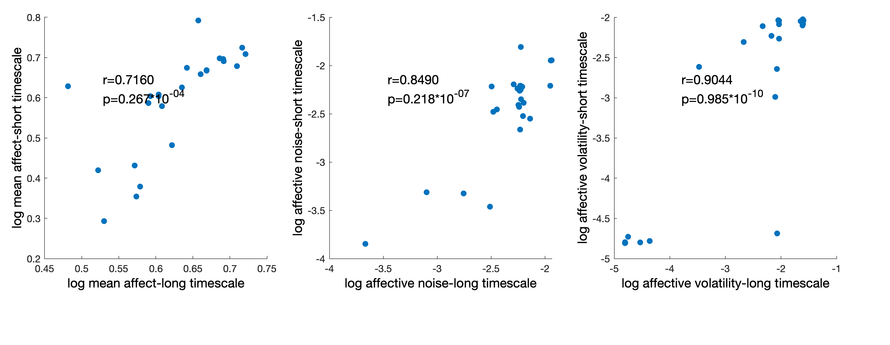
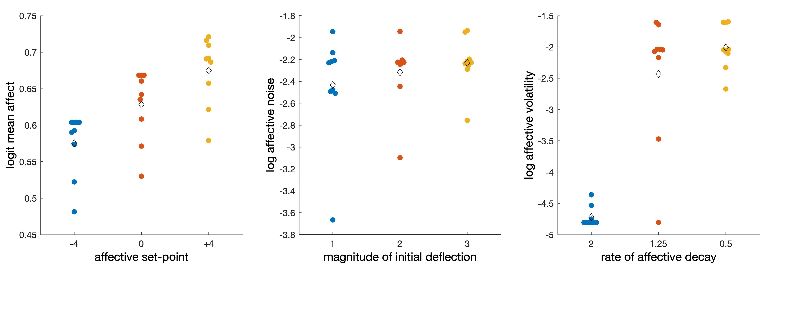
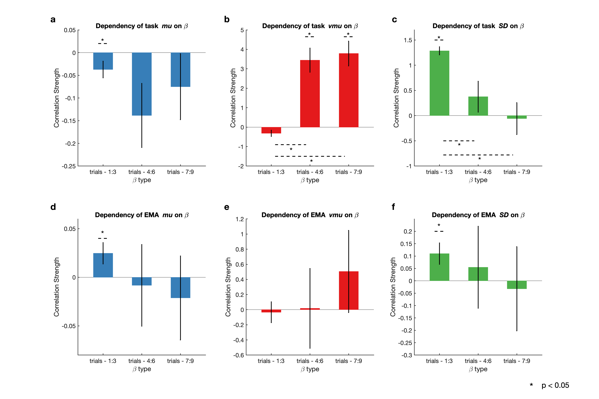

 Paper 1: Specific components of task based mood variability are associated with specific components of real world mood variability. The diurnal stuff could go in this paper.

The logic of this paper would be: mood variability is clinically interesting but difficult and time consuming to measure. You can split it up into different components but would be nice to assess whether we can study these components experimentally in the lab. We looked at whether we could do that by getting people to complete a task, and then following them up after. We found this specificity in terms of type of mood variability.

In addition we wondered about diurnal effects in the real world data, which were associated with noise, not volatility (the missing thing here would be an analysis of the link between the task and the diurnal stuff—might not work as diurnal effect is valence specific though).

# library 
```{r warning=FALSE,message=FALSE}
rm(list = ls())
setwd("/Users/yanyan/Desktop/MoodInstability/moodVariability/")
source(here::here("./scripts/load_library.R"))
```

```{r warning=FALSE,message=FALSE}
theme_set(theme_classic()+
          theme(text = element_text(family = "Helvetica", size = 10)))
vmuColor <- "red"
noiseColor <- 'royalblue3'
muColor <- 'forestgreen'
```

# load and combine data
```{r warning=FALSE,message=FALSE}
rmarkdown::render("./read_data_task_ema.Rmd")
source(here::here("./scripts/run_reg.R")) #X1~X3
source(here::here("./scripts/AR.R"))#autoregressive model functions

#join autoregressive PANAS
str <- c("PA_sum", "NA_sum","PAminusNA_sum") # your strings for naming the variables
result <- AR_PANAS(df_PANAS, str)
df_AR_PANAS <- data.frame(cbind(result$S,result$ui))
names(df_AR_PANAS) <- c(result$names,"Prolific.Id")
df_AR_PANAS <-df_AR_PANAS %>% mutate_at(vars(AR_PA_sum:AR_PAminusNA_sum),
                                             ~as.numeric(.x))

str = c("day1_block1","day1_block2","day2_block1","day2_block2")
result <- AR_task(df_mood_AR, str)
df_AR_task <- data.frame(cbind(result$S,result$ui))
names(df_AR_task) <- c(result$names,"Prolific.Id")

subj_exclude_novariance_ <- subj_exclude_novariance %>% 
  group_by(Participant.Public.ID) %>% 
  count() %>% 
  filter(n==2)

df_master <- left_join(df_master,df_AR_task,by = "Prolific.Id") %>% 
  left_join(df_AR_PANAS,by = "Prolific.Id") %>% 
  filter(!Prolific.Id %in% subj_exclude_novariance_$Participant.Public.ID) #these people have neither days ratings available due to constant ratings

demo_info <- demo_info %>% 
  filter(!participant_id %in% subj_exclude_novariance_$Participant.Public.ID,
         participant_id %in% df_master$Prolific.Id) #these people have neither days ratings available due to constant ratings

df_master[is.nan(as.matrix(df_master))] <- NA

df_master <- df_master%>% 
  mutate_at(vars(AR_PA_sum,AR_NA_sum,AR_PAminusNA_sum,
                 AR_day1_block1,AR_day1_block2,AR_day2_block1,AR_day2_block2), ~as.numeric(.)) %>% 
  mutate(AR_task = (AR_day1_block1 + AR_day2_block1)/2)

names(df_master)

sum(is.na(df_master$X1))
```
# demographics
```{r}
sum(is.na(demo_info$Sex))
summary(demo_info$Sex)
table(demo_info$Sex)

sum(is.na(demo_info$age))
table(demo_info$age)
mean(demo_info$age, na.rm = T)
sd(demo_info$age, na.rm = T)
min(demo_info$age, na.rm = T)
max(demo_info$age, na.rm = T)

table(demo_info$`Country of Birth`)

sum(is.na(demo_info$`First Language`))
table(demo_info$`First Language`)

table(demo_info$`Country of Birth`)

sum(is.na(demo_info$`Current Country of Residence`))
table(demo_info$`Current Country of Residence`)
```
## the day between two runs of apple tasks
```{r}
table(df_days$day_diff)
median(df_days$day_diff)
mean(df_days$day_diff)
sd(df_days$day_diff)

table(df_days$day_since_enrol)
median(df_days$day_since_enrol)
mean(df_days$day_since_enrol)
sd(df_days$day_since_enrol)
```

# summarise how many PANAS they filled
```{r}
df_PANAS_completion<-df_PANAS %>% 
  filter(Prolific.Id %in% df_master$Prolific.Id) %>% 
  group_by(Prolific.Id) %>% 
  count()

mean(df_PANAS_completion$n)
sd(df_PANAS_completion$n)
```

# mean questionnaire scores
```{r}
mean(df_master$CESD_sum)
sd(df_master$CESD_sum)

mean(df_master$HPS_sum)
sd(df_master$HPS_sum)

mean(df_master$STAI_SA_sum)
sd(df_master$STAI_SA_sum)

mean(df_master$STAI_TA_sum)
sd(df_master$STAI_TA_sum)

mean(df_master$TEPS_ant_sum)
sd(df_master$TEPS_ant_sum)

mean(df_master$TEPS_con_sum)
sd(df_master$TEPS_con_sum)
```


# part 1: Linking task and EMA mood variability

## 1.1 simulation demonstrating the plausibility of inferring long-term affective variability from task variability

$$Affect = setpoint + \sum_{t=1}^{T}event_t(a*e^{b(t-T)})$$


Figure 1 shows that affective parameters acquired from a small portion (3%) of affective time-series, generally appear to correlate with equivalent parameters acquired from the full time-series.


As illustrated in the 3 panels above, the filter’s estimated *mu* appears to generally increase as the affective set point increases, the filter’s estimated *SD* appears to generally increase as the initial deflection increases and the filter’s estimated *vmu* appears to generally increase as the decay rate decreases.

## 1.2 dependency of gorilla task parameters on emotional reactivity

(a-c) Task *SD* is associated with the immediate impact of task events, which is consistent with the idea that it reflects the magnitude of initial affective deflection from baseline. Task *vmu* is associated with the persistent impact of task events, which is consistent with the idea that it reflects the rate at which affect returns to baseline. Unexpectedly, task *mu* is negatively associated with the immediate impact of task events, it is unclear what this signifies.
(d-f)  As with task *SD*, ESM *SD* is associated with the immediate impact of task events, which is consistent with the idea that 𝑆𝐷 in everyday life reflects the magnitude of initial affective deflections from baseline. ESM *vmu* does not bear any significant relationship to the duration of responses to task events. ESM *mu* shows the same pattern of associations as ESM *SD*.

```{r}
chart.Correlation(df_master %>% 
                    dplyr::select(X1,X2,X3))

chart.Correlation(df_master %>% 
                    dplyr::select(X1o,X2o,X3o))
```


```{r}
l1 <- lmer(value ~ regression_coef + (1|Participant.Public.ID),df_Xs_scaled_all_long %>% 
            mutate(regression_coef = factor(regression_coef,levels = c("X1","X2","X3"),labels = c("trial -1~3","trial -4~6","trial -7~9"))))

summary(l1)
round(confint(l1, level=0.95),3)
summary(l11<-lmer(value ~ regression_coef + (1|Participant.Public.ID),df_Xs_scaled_all_long %>% 
            mutate(regression_coef = factor(regression_coef,levels = c("X2","X3","X1")))))
round(confint(l11, level=0.95),3)

l <- as.data.frame(effects::Effect(c("regression_coef"),l1))
p0 <-ggplot(data=l, aes(x = regression_coef, y = fit))+
  geom_jitter(data = df_Xs_scaled_all_long%>% 
            mutate(regression_coef = factor(regression_coef,levels = c("X1","X2","X3"),labels = c("trial -1~3","trial -4~6","trial -7~9"))),
                   aes(x = regression_coef, y = value), size = 0.3,color = 'pink',alpha = 0.5)+
   geom_point()+
  geom_errorbar(data=l, aes(x = regression_coef, ymin = lower, ymax = upper),
                width = 0.2)+
  labs(x = "Time of affective impact",
       title = "")+
  geom_hline(yintercept = 0, linetype = "dashed")

s1a <- summary(l1a<-lm(scale(mean_mu) ~ scale(X1), df_master))
round(confint(l1a, level=0.95),3)
ss1b <- summary(lm(scale(mean_mu) ~ scale(X1) + scale(X2), df_master))
round(confint(lm(scale(mean_mu) ~ scale(X1) + scale(X2), df_master), level=0.95),3)
ss1c <- summary(lm(scale(mean_mu) ~ scale(X1) + scale(X2) + scale(X3), df_master))
round(confint(lm(scale(mean_mu) ~ scale(X1) + scale(X2) + scale(X3), df_master), level=0.95),3)
summary(ll<-lm(scale(mean_mu) ~ scale(X1) + scale(X2) + scale(X3) + scale(mean5_s) + scale(mean5_vmu), df_master))
round(confint(ll, level=0.95),3)
  
df_master$residuals1[!is.na(df_master$X1)] <- as.vector(residuals(s1a))
s1bb <- summary(l1b<-lm(scale(residuals1) ~ scale(X2), df_master))
round(confint(l1b, level=0.95),3)
df_master$residuals2[!is.na(df_master$X2)] <- as.vector(residuals(s1bb))
s1cc <- summary(l1c<-lm(scale(residuals2) ~ scale(X3), df_master))
round(confint(l1c, level=0.95),3)

s2a <- summary(l2a<-lm(scale(mean5_vmu) ~ scale(X1), df_master))
round(confint(l2a, level=0.95),3)
s2b <- summary(lm(scale(mean5_vmu) ~ scale(X1) + scale(X2), df_master))
s2c <- summary(lm(scale(mean5_vmu) ~ scale(X1) + scale(X2) + scale(X3), df_master))

df_master$residuals1[!is.na(df_master$X1)] <- as.vector(residuals(s2a))
s2bb <- summary(l2b<-lm(scale(residuals1) ~ scale(X2), df_master))
round(confint(l2b, level=0.95),3)
df_master$residuals2[!is.na(df_master$X2)] <- as.vector(residuals(s2bb))
s2cc <- summary(l2c<-lm(scale(residuals2) ~ scale(X3), df_master))
round(confint(l2c, level=0.95),3)

s3a <- summary(l3a<-lm(scale(mean5_s) ~ scale(X1), df_master))
round(confint(l3a, level=0.95),3)
s3b <- summary(lm(scale(mean5_s) ~ scale(X1) + scale(X2), df_master))
s3c <- summary(lm(scale(mean5_s) ~ scale(X1) + scale(X2) + scale(X3), df_master))


df_master$residuals1[!is.na(df_master$X1)] <- as.vector(residuals(s3a))
s3bb <- summary(l3b<-lm(scale(residuals1) ~ scale(X2), df_master))
round(confint(l3b, level=0.95),3)
df_master$residuals2[!is.na(df_master$X2)] <- as.vector(residuals(s3bb))
s3cc <- summary(l3c<-lm(scale(residuals2) ~ scale(X3), df_master))
round(confint(l3c, level=0.95),3)

bars <- Reduce(rbind,
       list(as.data.frame(rbind(s1a$coefficients[2,],
                                s1bb$coefficients[2,],
                                s1cc$coefficients[2,]))
                          %>% 
              mutate(reg = "task mean"),
            as.data.frame(rbind(s2a$coefficients[2,],
                                s2bb$coefficients[2,],
                                s2cc$coefficients[2,])) %>% 
              mutate(reg = "task volatility"),
            as.data.frame(rbind(s3a$coefficients[2,],
                                s3bb$coefficients[2,],
                                s3cc$coefficients[2,])) %>% 
              mutate(reg = "task noise"))) %>% 
  rownames_to_column() %>% 
  rename(variable = rowname,
         se = `Std. Error`,
         p_val = `Pr(>|t|)`) %>% 
  mutate(sig = ifelse(p_val < .001, "***",
                      ifelse(p_val < .01, "**",
                             ifelse(p_val < .05,"*",
                                    ifelse(p_val < .1,"†","ns")))))

bars$variable <- rep(c("trial -1~3","trial -4~6","trial -7~9"),3)

p1 <- ggplot(bars %>% 
         filter(!grepl("Intercept",variable)) %>% 
         mutate(variable = factor(variable, levels = c("trial -1~3","trial -4~6","trial -7~9")),
                reg = factor(reg,levels = c("task mean","task volatility","task noise") )) %>% 
           filter(reg != "task mean"))+
  geom_col(aes(x = variable, y = Estimate, fill = reg),
           width = 0.5)+
  geom_errorbar(aes(x = variable, ymin = Estimate - se, ymax = Estimate + se),
                width = 0.1)+
  facet_wrap(~reg)+
  scale_fill_manual(values = c(vmuColor,noiseColor))+
  scale_alpha_manual(values = c("1" = 1, "0" = 0.5), guide = "none")+
  labs(y = "Standardized regression weights",
       x = "Time of affective impact")+
  geom_text(aes(x = variable, y = (Estimate + (Estimate) / abs(Estimate) * se  
                                   + (Estimate) / abs(Estimate) * 0.05), label = sig))+
  theme(legend.position = "none")+
  ylim(-0.35,0.9)

p1orig <- p1+
  labs(title = "stepwise approach")

mean(df_totalmon$day1_block1)
sd(df_totalmon$day1_block1)

mean(df_totalmon$day2_block1)
sd(df_totalmon$day2_block1)
```

### 1.2.2 Dependency of PANAS parameter on emotional reactivity
```{r}
s1a <- summary(lm(scale(mean_mu_posminusneg) ~ scale(X1), df_master))
confint(lm(scale(mean_mu_posminusneg) ~ scale(X1), df_master))
s1b <- summary(lm(scale(mean_mu_posminusneg) ~ scale(X1) + scale(X2), df_master))
s1c <- summary(lm(scale(mean_mu_posminusneg) ~ scale(X1) + scale(X2) + scale(X3), df_master))

df_master$residuals1[!is.na(df_master$X1)] <- as.vector(residuals(s1a))
s1bb <- summary(lm(scale(residuals1) ~ scale(X2), df_master))
df_master$residuals2[!is.na(df_master$X2)] <- as.vector(residuals(s1bb))
s1cc <- summary(lm(scale(residuals2) ~ scale(X3), df_master))

s2a <- summary(lm(scale(mean5_vmu_posminusneg) ~ scale(X1), df_master))
s2b <- summary(lm(scale(mean5_vmu_posminusneg) ~ scale(X1) + scale(X2), df_master))
s2c <- summary(lm(scale(mean5_vmu_posminusneg) ~ scale(X1) + scale(X2) + scale(X3), df_master))

df_master$residuals1[!is.na(df_master$X1)] <- as.vector(residuals(s2a))
s2bb <- summary(lm(scale(residuals1) ~ scale(X2), df_master))
df_master$residuals2[!is.na(df_master$X2)] <- as.vector(residuals(s2bb))
s2cc <- summary(lm(scale(residuals2) ~ scale(X3), df_master))

s3a <- summary(lm(scale(mean5_s_posminusneg) ~ scale(X1), df_master))
s3b <- summary(lm(scale(mean5_s_posminusneg) ~ scale(X1) + scale(X2), df_master))
confint(lm(scale(mean5_s_posminusneg) ~ scale(X1) + scale(X2), df_master))
s3c <- summary(lm(scale(mean5_s_posminusneg) ~ scale(X1) + scale(X2) + scale(X3), df_master))

df_master$residuals1[!is.na(df_master$X1)] <- as.vector(residuals(s3a))
s3bb <- summary(lm(scale(residuals1) ~ scale(X2), df_master))
df_master$residuals2[!is.na(df_master$X2)] <- as.vector(residuals(s3bb))
s3cc <- summary(lm(scale(residuals2) ~ scale(X3), df_master))

summary(lm(scale(X1) ~ scale(mean5_s_posminusneg) +scale(mean_mu_posminusneg), df_master))

#why is esm mean and esm noise both correlated with trial 1-3?
ppcor::pcor(df_master %>% 
              dplyr::select(mean5_s_posminusneg,mean_mu_posminusneg,X1) %>% 
              drop_na())
bars <- Reduce(rbind,
       list(as.data.frame(rbind(s1a$coefficients[2,],
                                s1bb$coefficients[2,],
                                s1cc$coefficients[2,]))
                          %>% 
              mutate(reg = "ESM mean"),
            as.data.frame(rbind(s2a$coefficients[2,],
                                s2bb$coefficients[2,],
                                s2cc$coefficients[2,])) %>% 
              mutate(reg = "ESM volatility"),
            as.data.frame(rbind(s3a$coefficients[2,],
                                s3bb$coefficients[2,],
                                s3cc$coefficients[2,])) %>% 
              mutate(reg = "ESM noise"))) %>% 
  rownames_to_column() %>% 
  rename(variable = rowname,
         se = `Std. Error`,
         p_val = `Pr(>|t|)`) %>% 
  mutate(sig = ifelse(p_val < .001, "***",
                      ifelse(p_val < .01, "**",
                             ifelse(p_val < .05,"*",
                                    ifelse(p_val < .1,"†","ns")))))

bars$variable <- rep(c("trial -1~3","trial -4~6","trial -7~9"),3)

p2 <- ggplot(bars %>% 
         filter(!grepl("Intercept",variable)) %>% 
         mutate(variable = factor(variable, levels = c("trial -1~3","trial -4~6","trial -7~9")),
                reg = factor(reg,levels = c("ESM mean","ESM volatility","ESM noise") )) %>% 
           filter(reg != "ESM mean"))+
  geom_col(aes(x = variable, y = Estimate, fill = reg),
           width = 0.5)+
  geom_errorbar(aes(x = variable, ymin = Estimate - se, ymax = Estimate + se),
                width = 0.1)+
  facet_wrap(~reg)+
  scale_fill_manual(values = c(vmuColor,noiseColor))+
  scale_alpha_manual(values = c("1" = 1, "0" = 0.5), guide = "none")+
  labs(y = "Standardized regression weights",
       x = "Time of affective impact")+
  geom_text(aes(x = variable, 
                y = (Estimate + (Estimate) / abs(Estimate) * se  + (Estimate) / abs(Estimate) * 0.05), label = sig))+
  theme(legend.position = "none")+
  ylim(-0.35,0.85)

p0+(p1/p2)+
  plot_annotation(tag_levels = "A")+
  plot_layout(width = c(1,2))

ggsave("../figures/figure_x1x3.png",width = 6, height = 5)

p0+(p1)+
  plot_annotation(tag_levels = "A")+
  plot_layout(width = c(1,2))

ggsave("../figures/figure_x1x3_new.png",width = 7, height = 4)

p2

ggsave("../figures/figure_x1x3_si.png",width = 6, height = 4)

summary(lm(scale(X1) ~  scale(mean_mu)+ scale(mean5_s) +scale(mean5_vmu), df_master))
summary(lm(scale(X2) ~  scale(mean_mu)+ scale(mean5_s) +scale(mean5_vmu), df_master))
summary(lm(scale(X3) ~  scale(mean_mu)+ scale(mean5_s) +scale(mean5_vmu), df_master))
```


### each beta separately
```{r}
s1a <- summary(lm(scale(mean_mu) ~ scale(X1), df_master))
s1b <- summary(lm(scale(mean_mu) ~ scale(X2), df_master))
s1c <- summary(lm(scale(mean_mu) ~ scale(X3), df_master))

s2a <- summary(lm(scale(mean5_vmu) ~ scale(X1), df_master))
s2b <- summary(lm(scale(mean5_vmu) ~ scale(X2), df_master))
s2c <- summary(lm(scale(mean5_vmu) ~ scale(X3), df_master))

s3a <- summary(lm(scale(mean5_s) ~ scale(X1), df_master))
s3b <- summary(lm(scale(mean5_s) ~ scale(X2), df_master))
s3c <- summary(lm(scale(mean5_s) ~ scale(X3), df_master))


bars <- Reduce(rbind,
       list(as.data.frame(s1a$coefficients) %>% 
              mutate(reg = "task mean"),
            as.data.frame(s1b$coefficients) %>% 
              mutate(reg = "task mean"),
            as.data.frame(s1c$coefficients) %>% 
              mutate(reg = "task mean"),
            as.data.frame(s2a$coefficients) %>% 
              mutate(reg = "task volatility"),
            as.data.frame(s2b$coefficients) %>% 
              mutate(reg = "task volatility"),
            as.data.frame(s2c$coefficients) %>% 
              mutate(reg = "task volatility"),
            as.data.frame(s3a$coefficients) %>% 
              mutate(reg = "task noise"),
            as.data.frame(s3b$coefficients) %>% 
              mutate(reg = "task noise"),
            as.data.frame(s3c$coefficients) %>% 
              mutate(reg = "task noise"))) %>% 
  rownames_to_column() %>% 
  rename(variable = rowname,
         se = `Std. Error`,
         p_val = `Pr(>|t|)`) %>% 
  mutate(sig = ifelse(p_val < .001, "***",
                      ifelse(p_val < .01, "**",
                             ifelse(p_val < .05,"*",
                                    ifelse(p_val < .1,"†","ns")))))

bars$variable[grepl("X1",bars$variable)] <- "trial -1~3"
bars$variable[grepl("X2",bars$variable)] <- "trial -4~6"
bars$variable[grepl("X3",bars$variable)] <- "trial -7~9"

p1 <- ggplot(bars %>% 
         filter(!grepl("Intercept",variable)) %>% 
         mutate(variable = factor(variable, levels = c("trial -1~3","trial -4~6","trial -7~9")),
                reg = factor(reg,levels = c("task mean","task volatility","task noise") )) %>% 
           filter(reg != "task mean"))+
  geom_col(aes(x = variable, y = Estimate, fill = reg),
           width = 0.5)+
  geom_errorbar(aes(x = variable, ymin = Estimate - se, ymax = Estimate + se),
                width = 0.1)+
  facet_wrap(~reg)+
  scale_fill_manual(values = c(vmuColor,noiseColor))+
  scale_alpha_manual(values = c("1" = 1, "0" = 0.5), guide = "none")+
  labs(y = "Standardized regression weights",
       x = "Time of affective impact",
       title = "Separate regression models")+
  geom_text(aes(x = variable, y = (Estimate + (Estimate) / abs(Estimate) * se  
                                   + (Estimate) / abs(Estimate) * 0.05), label = sig))+
  theme(legend.position = "none")+
  ylim(-0.4,0.85)

s1a <- summary(lm(scale(mean_mu_posminusneg) ~ scale(X1), df_master))
s1b <- summary(lm(scale(mean_mu_posminusneg) ~ scale(X2), df_master))
s1c <- summary(lm(scale(mean_mu_posminusneg) ~ scale(X3), df_master))

s2a <- summary(lm(scale(mean5_vmu_posminusneg) ~ scale(X1), df_master))
s2b <- summary(lm(scale(mean5_vmu_posminusneg) ~ scale(X2), df_master))
s2c <- summary(lm(scale(mean5_vmu_posminusneg) ~ scale(X3), df_master))

s3a <- summary(lm(scale(mean5_s_posminusneg) ~ scale(X1), df_master))
s3b <- summary(lm(scale(mean5_s_posminusneg) ~ scale(X2), df_master))
s3c <- summary(lm(scale(mean5_s_posminusneg) ~ scale(X3), df_master))

bars <- Reduce(rbind,
       list(as.data.frame(s1a$coefficients) %>% 
              mutate(reg = "ESM mean"),
            as.data.frame(s1b$coefficients) %>% 
              mutate(reg = "ESM mean"),
            as.data.frame(s1c$coefficients) %>% 
              mutate(reg = "ESM mean"),
            as.data.frame(s2a$coefficients) %>% 
              mutate(reg = "ESM volatility"),
            as.data.frame(s2b$coefficients) %>% 
              mutate(reg = "ESM volatility"),
            as.data.frame(s2c$coefficients) %>% 
              mutate(reg = "ESM volatility"),
            as.data.frame(s3a$coefficients) %>% 
              mutate(reg = "ESM noise"),
            as.data.frame(s3b$coefficients) %>% 
              mutate(reg = "ESM noise"),
            as.data.frame(s3c$coefficients) %>% 
              mutate(reg = "ESM noise"))) %>% 
  rownames_to_column() %>% 
  rename(variable = rowname,
         se = `Std. Error`,
         p_val = `Pr(>|t|)`) %>% 
  mutate(sig = ifelse(p_val < .001, "***",
                      ifelse(p_val < .01, "**",
                             ifelse(p_val < .05,"*",
                                    ifelse(p_val < .1,"†","ns")))))

bars$variable[grepl("X1",bars$variable)] <- "trial -1~3"
bars$variable[grepl("X2",bars$variable)] <- "trial -4~6"
bars$variable[grepl("X3",bars$variable)] <- "trial -7~9"

p2 <- ggplot(bars %>% 
         filter(!grepl("Intercept",variable)) %>% 
         mutate(variable = factor(variable, levels = c("trial -1~3","trial -4~6","trial -7~9")),
                reg = factor(reg,levels = c("ESM mean","ESM volatility","ESM noise") )) %>% 
           filter(reg != "ESM mean"))+
  geom_col(aes(x = variable, y = Estimate, fill = reg),
           width = 0.5)+
  geom_errorbar(aes(x = variable, ymin = Estimate - se, ymax = Estimate + se),
                width = 0.1)+
  facet_wrap(~reg)+
  scale_fill_manual(values = c(vmuColor,noiseColor))+
  scale_alpha_manual(values = c("1" = 1, "0" = 0.5), guide = "none")+
  labs(y = "Standardized regression weights",
       x = "Time of affective impact",
       title = "Separate regression models")+
  geom_text(aes(x = variable, 
                y = (Estimate + (Estimate) / abs(Estimate) * se  + (Estimate) / abs(Estimate) * 0.05), label = sig))+
  theme(legend.position = "none")+
  ylim(-0.4,0.8)

(p1/p2)+
  plot_annotation(tag_levels = "A")

ggsave("../figures/figure_x1x3_sep.png",width = 6, height = 7)
```

### same analysis, with considering magnitude
```{r}
ggplot(df_master, aes(x = X1, y = X1o))+
  geom_point(size = 0.5)+
  geom_smooth(method = "lm")+
  labs(x = expression("" * beta * "1 outcome"),
       y = expression("" * beta * "1 magnitude"),
       title = "Raw coefficients")+
ggplot(df_master, aes(x = X2, y = X2o))+
  geom_point(size = 0.5)+
  geom_smooth(method = "lm")+
  labs(x = expression("" * beta * "2 outcome"),
       y = expression("" * beta * "2 magnitude"))+
ggplot(df_master, aes(x = X3, y = X3o))+
  geom_point(size = 0.5)+
  geom_smooth(method = "lm")+
  labs(x = expression("" * beta * "3 outcome"),
       y = expression("" * beta * "3 magnitude"))+
ggplot(df_master, aes(x = X1, y = X1mo))+
  geom_point(size = 0.5)+
  geom_smooth(method = "lm")+
    labs(x = expression("" * beta * "1 outcome"),
       y = expression("" * beta * "1 magnitude"),
       title = "Orthogonalized coefficients")+
ggplot(df_master, aes(x = X2, y = X2mo))+
  geom_point(size = 0.5)+
  geom_smooth(method = "lm")+
    labs(x = expression("" * beta * "2 outcome"),
       y = expression("" * beta * "2 magnitude"))+
ggplot(df_master, aes(x = X3, y = X3mo))+
  geom_point(size = 0.5)+
  geom_smooth(method = "lm")+
    labs(x = expression("" * beta * "3 outcome"),
       y = expression("" * beta * "3 magnitude"))

ggsave("../figures/corr_mag.png",width = 8, height = 5)
```

```{r}
l1 <- lmer(value ~ regression_coef + (1|Participant.Public.ID),df_Xs_scaled_all2_long %>% 
            mutate(regression_coef = factor(regression_coef,levels = c("X1mo","X2mo","X3mo"),labels = c("trial -1~3","trial -4~6","trial -7~9"))) %>% 
             filter(!is.na(regression_coef)))

summary(l1)


l2 <- lmer(value ~ regression_coef + (1|Participant.Public.ID),df_Xs_scaled_all2_long %>% 
            mutate(regression_coef = factor(regression_coef,levels = c("X1o","X2o","X3o"),labels = c("trial -1~3","trial -4~6","trial -7~9"))) %>% 
             filter(!is.na(regression_coef)))

summary(l2)

# p0 <- plot_model(l1, "pred", terms = "regression_coef",
#            show.data = F, jitter = T, dot.size = 0.7,ci.style = "bar")+
#   labs(x = "Time of affective impact",
#        title = "reward magnitude (-4~5)")+
#   geom_hline(yintercept = 0, linetype = "dashed")+
# plot_model(l2, "pred", terms = "regression_coef",
#            show.data = F, jitter = T, dot.size = 0.7,ci.style = "bar")+
#   labs(x = "Time of affective impact",
#        title = "binary outcome (0 or 1)")+
#   geom_hline(yintercept = 0, linetype = "dashed")+
# plot_layout(nrow = 1)


l <- as.data.frame(effects::Effect(c("regression_coef"),l1))
l_ <- as.data.frame(effects::Effect(c("regression_coef"),l2))
p0 <-ggplot(data=l, aes(x = regression_coef, y = fit))+
  geom_jitter(data = df_Xs_scaled_all2_long%>% 
            mutate(regression_coef = factor(regression_coef,levels = c("X1mo","X2mo","X3mo"),labels = c("trial -1~3","trial -4~6","trial -7~9"))) %>% 
                     filter(!is.na(regression_coef)),
                   aes(x = regression_coef, y = value), size = 0.3,color = 'pink',alpha = 0.5)+
   geom_point()+
  geom_errorbar(data=l, aes(x = regression_coef, ymin = lower, ymax = upper),
                width = 0.2)+
  labs(x = "Time of affective impact",
       title = "Reward magnitude (-4~5)")+
  geom_hline(yintercept = 0, linetype = "dashed")+
ggplot(data=l_, aes(x = regression_coef, y = fit))+
  geom_jitter(data = df_Xs_scaled_all2_long%>% 
            mutate(regression_coef = factor(regression_coef,levels = c("X1o","X2o","X3o"),labels = c("trial -1~3","trial -4~6","trial -7~9")))%>% 
                     filter(!is.na(regression_coef)),
                   aes(x = regression_coef, y = value), size = 0.3,color = 'pink',alpha = 0.5)+
   geom_point()+
  geom_errorbar(data=l_, aes(x = regression_coef, ymin = lower, ymax = upper),
                width = 0.2)+
  labs(x = "Time of affective impact",
       title = "Binary reward outcome (0 or 1)")+
  geom_hline(yintercept = 0, linetype = "dashed")

s1a <- summary(lm(scale(mean_mu) ~ scale(X1mo), df_master))
s1b <- summary(lm(scale(mean_mu) ~ scale(X1mo) + scale(X2mo), df_master))
s1c <- summary(lm(scale(mean_mu) ~ scale(X1mo) + scale(X2mo) + scale(X3mo), df_master))

s2a <- summary(lm(scale(mean5_vmu) ~ scale(X1mo), df_master))
s2b <- summary(lm(scale(mean5_vmu)  ~ scale(X1mo) + scale(X2mo), df_master))
s2c <- summary(lm(scale(mean5_vmu) ~ scale(X1mo) + scale(X2mo) + scale(X3mo), df_master))

s3a <- summary(lm(scale(mean5_s) ~ scale(X1mo), df_master))
s3b <- summary(lm(scale(mean5_s)  ~ scale(X1mo) + scale(X2mo), df_master))
s3c <- summary(lm(scale(mean5_s) ~ scale(X1mo) + scale(X2mo) + scale(X3mo), df_master))


df_master$residuals1[!is.na(df_master$X1mo)] <- as.vector(residuals(s1a))
s1bb <- summary(lm(scale(residuals1) ~ scale(X2mo), df_master))
df_master$residuals2[!is.na(df_master$X2mo)] <- as.vector(residuals(s1bb))
s1cc <- summary(lm(scale(residuals2) ~ scale(X3mo), df_master))

df_master$residuals1[!is.na(df_master$X1mo)] <- as.vector(residuals(s2a))
s2bb <- summary(lm(scale(residuals1) ~ scale(X2mo), df_master))
df_master$residuals2[!is.na(df_master$X2mo)] <- as.vector(residuals(s2bb))
s2cc <- summary(lm(scale(residuals2) ~ scale(X3mo), df_master))

df_master$residuals1[!is.na(df_master$X1mo)] <- as.vector(residuals(s3a))
s3bb <- summary(lm(scale(residuals1) ~ scale(X2mo), df_master))
df_master$residuals2[!is.na(df_master$X2mo)] <- as.vector(residuals(s3bb))
s3cc <- summary(lm(scale(residuals2) ~ scale(X3mo), df_master))

bars <- Reduce(rbind,
       list(as.data.frame(rbind(s1a$coefficients[2,],
                                s1bb$coefficients[2,],
                                s1cc$coefficients[2,]))
                          %>% 
              mutate(reg = "task mean"),
            as.data.frame(rbind(s2a$coefficients[2,],
                                s2bb$coefficients[2,],
                                s2cc$coefficients[2,])) %>% 
              mutate(reg = "task volatility"),
            as.data.frame(rbind(s3a$coefficients[2,],
                                s3bb$coefficients[2,],
                                s3cc$coefficients[2,])) %>% 
              mutate(reg = "task noise"))) %>% 
  rownames_to_column() %>% 
  rename(variable = rowname,
         se = `Std. Error`,
         p_val = `Pr(>|t|)`) %>% 
  mutate(sig = ifelse(p_val < .001, "***",
                      ifelse(p_val < .01, "**",
                             ifelse(p_val < .05,"*",
                                    ifelse(p_val < .1,"†","ns")))))

bars$variable <- rep(c("trial -1~3","trial -4~6","trial -7~9"),3)

p1mo <- ggplot(bars %>% 
         filter(!grepl("Intercept",variable)) %>% 
         mutate(variable = factor(variable, levels = c("trial -1~3","trial -4~6","trial -7~9")),
                reg = factor(reg,levels = c("task mean","task volatility","task noise") )) %>% 
           filter(reg != "task mean"))+
  geom_col(aes(x = variable, y = Estimate, fill = reg),
           width = 0.5)+
  geom_errorbar(aes(x = variable, ymin = Estimate - se, ymax = Estimate + se),
                width = 0.1)+
  facet_wrap(~reg)+
  scale_fill_manual(values = c(vmuColor,noiseColor))+
  scale_alpha_manual(values = c("1" = 1, "0" = 0.5), guide = "none")+
  labs(y = "Standardized regression weights",
       x = "Time of affective impact",
       title = "Reward magnitude")+
  geom_text(aes(x = variable, y = (Estimate + (Estimate) / abs(Estimate) * se  
                                   + (Estimate) / abs(Estimate) * 0.05), label = sig))+
  theme(legend.position = "none")+
  ylim(-0.35,0.85)+ 
  theme(axis.text.x = element_text(angle = 45))

s1a <- summary(lm(scale(mean_mu_posminusneg) ~ scale(X1mo), df_master))
s1b <- summary(lm(scale(mean_mu_posminusneg) ~ scale(X1mo) + scale(X2mo), df_master))
s1c <- summary(lm(scale(mean_mu_posminusneg) ~ scale(X1mo) + scale(X2mo) + scale(X3mo), df_master))

s2a <- summary(lm(scale(mean5_vmu_posminusneg) ~ scale(X1mo), df_master))
s2b <- summary(lm(scale(mean5_vmu_posminusneg)  ~ scale(X1mo) + scale(X2mo), df_master))
s2c <- summary(lm(scale(mean5_vmu_posminusneg) ~ scale(X1mo) + scale(X2mo) + scale(X3mo), df_master))

s3a <- summary(lm(scale(mean5_s_posminusneg) ~ scale(X1mo), df_master))
s3b <- summary(lm(scale(mean5_s_posminusneg)  ~ scale(X1mo) + scale(X2mo), df_master))
s3c <- summary(lm(scale(mean5_s_posminusneg) ~ scale(X1mo) + scale(X2mo) + scale(X3mo), df_master))


df_master$residuals1[!is.na(df_master$X1mo)] <- as.vector(residuals(s1a))
s1bb <- summary(lm(scale(residuals1) ~ scale(X2mo), df_master))
df_master$residuals2[!is.na(df_master$X2mo)] <- as.vector(residuals(s1bb))
s1cc <- summary(lm(scale(residuals2) ~ scale(X3mo), df_master))

df_master$residuals1[!is.na(df_master$X1mo)] <- as.vector(residuals(s2a))
s2bb <- summary(lm(scale(residuals1) ~ scale(X2mo), df_master))
df_master$residuals2[!is.na(df_master$X2mo)] <- as.vector(residuals(s2bb))
s2cc <- summary(lm(scale(residuals2) ~ scale(X3mo), df_master))

df_master$residuals1[!is.na(df_master$X1mo)] <- as.vector(residuals(s3a))
s3bb <- summary(lm(scale(residuals1) ~ scale(X2mo), df_master))
df_master$residuals2[!is.na(df_master$X2mo)] <- as.vector(residuals(s3bb))
s3cc <- summary(lm(scale(residuals2) ~ scale(X3mo), df_master))

bars <- Reduce(rbind,
       list(as.data.frame(rbind(s1a$coefficients[2,],
                                s1bb$coefficients[2,],
                                s1cc$coefficients[2,]))
                          %>% 
              mutate(reg = "ESM mean"),
            as.data.frame(rbind(s2a$coefficients[2,],
                                s2bb$coefficients[2,],
                                s2cc$coefficients[2,])) %>% 
              mutate(reg = "ESM volatility"),
            as.data.frame(rbind(s3a$coefficients[2,],
                                s3bb$coefficients[2,],
                                s3cc$coefficients[2,])) %>% 
              mutate(reg = "ESM noise"))) %>% 
  rownames_to_column() %>% 
  rename(variable = rowname,
         se = `Std. Error`,
         p_val = `Pr(>|t|)`) %>% 
  mutate(sig = ifelse(p_val < .001, "***",
                      ifelse(p_val < .01, "**",
                             ifelse(p_val < .05,"*",
                                    ifelse(p_val < .1,"†","ns")))))

bars$variable <- rep(c("trial -1~3","trial -4~6","trial -7~9"),3)

p2mo <- ggplot(bars %>% 
         filter(!grepl("Intercept",variable)) %>% 
         mutate(variable = factor(variable, levels = c("trial -1~3","trial -4~6","trial -7~9")),
                reg = factor(reg,levels = c("ESM mean","ESM volatility","ESM noise") )) %>% 
           filter(reg != "ESM mean"))+
  geom_col(aes(x = variable, y = Estimate, fill = reg),
           width = 0.5)+
  geom_errorbar(aes(x = variable, ymin = Estimate - se, ymax = Estimate + se),
                width = 0.1)+
  facet_wrap(~reg)+
  scale_fill_manual(values = c(vmuColor,noiseColor))+
  scale_alpha_manual(values = c("1" = 1, "0" = 0.5), guide = "none")+
  labs(y = "Standardized regression weights",
       x = "Time of affective impact",
       title = "Reward magnitude")+
  geom_text(aes(x = variable, y = (Estimate + (Estimate) / abs(Estimate) * se  
                                   + (Estimate) / abs(Estimate) * 0.05), label = sig))+
  theme(legend.position = "none")+
  ylim(-0.35,0.85)+ 
  theme(axis.text.x = element_text(angle = 45))

p1mo/p2mo

p0
ggsave("../figures/figure_mag_out_dist.png",width = 6, height = 3)
```

```{r}
l1 <- lmer(value ~ regression_coef + (1|Participant.Public.ID),df_Xs_scaled_all2_long %>% 
            mutate(regression_coef = factor(regression_coef,levels = c("X1o","X2o","X3o"),labels = c("trial -1~3","trial -4~6","trial -7~9"))) %>% 
             filter(!is.na(regression_coef)))

summary(l1)

p0 <- plot_model(l1, "pred",terms = "regression_coef",
           show.data = T, jitter = T, dot.size = 0.7,ci.style = "bar")+
  labs(x = "Time of affective impact",
       title = "binary outcome")+
  geom_hline(yintercept = 0, linetype = "dashed")

s1a <- summary(lm(scale(mean_mu) ~ scale(X1o), df_master))
s1b <- summary(lm(scale(mean_mu) ~ scale(X1o) + scale(X2o), df_master))
s1c <- summary(lm(scale(mean_mu) ~ scale(X1o) + scale(X2o) + scale(X3mo), df_master))

s2a <- summary(lm(scale(mean5_vmu) ~ scale(X1o), df_master))
s2b <- summary(lm(scale(mean5_vmu)  ~ scale(X1o) + scale(X2o), df_master))
s2c <- summary(lm(scale(mean5_vmu) ~ scale(X1o) + scale(X2o) + scale(X3o), df_master))

s3a <- summary(lm(scale(mean5_s) ~ scale(X1o), df_master))
s3b <- summary(lm(scale(mean5_s)  ~ scale(X1o) + scale(X2o), df_master))
s3c <- summary(lm(scale(mean5_s) ~ scale(X1o) + scale(X2o) + scale(X3o), df_master))

df_master$residuals1[!is.na(df_master$X1o)] <- as.vector(residuals(s1a))
s1bb <- summary(lm(scale(residuals1) ~ scale(X2o), df_master))
df_master$residuals2[!is.na(df_master$X2o)] <- as.vector(residuals(s1bb))
s1cc <- summary(lm(scale(residuals2) ~ scale(X3o), df_master))

df_master$residuals1[!is.na(df_master$X1o)] <- as.vector(residuals(s2a))
s2bb <- summary(lm(scale(residuals1) ~ scale(X2o), df_master))
df_master$residuals2[!is.na(df_master$X2o)] <- as.vector(residuals(s2bb))
s2cc <- summary(lm(scale(residuals2) ~ scale(X3o), df_master))

df_master$residuals1[!is.na(df_master$X1o)] <- as.vector(residuals(s3a))
s3bb <- summary(lm(scale(residuals1) ~ scale(X2o), df_master))
df_master$residuals2[!is.na(df_master$X2o)] <- as.vector(residuals(s3bb))
s3cc <- summary(lm(scale(residuals2) ~ scale(X3o), df_master))

bars <- Reduce(rbind,
       list(as.data.frame(rbind(s1a$coefficients[2,],
                                s1bb$coefficients[2,],
                                s1cc$coefficients[2,]))
                          %>% 
              mutate(reg = "task mean"),
            as.data.frame(rbind(s2a$coefficients[2,],
                                s2bb$coefficients[2,],
                                s2cc$coefficients[2,])) %>% 
              mutate(reg = "task volatility"),
            as.data.frame(rbind(s3a$coefficients[2,],
                                s3bb$coefficients[2,],
                                s3cc$coefficients[2,])) %>% 
              mutate(reg = "task noise"))) %>% 
  rownames_to_column() %>% 
  rename(variable = rowname,
         se = `Std. Error`,
         p_val = `Pr(>|t|)`) %>% 
  mutate(sig = ifelse(p_val < .001, "***",
                      ifelse(p_val < .01, "**",
                             ifelse(p_val < .05,"*",
                                    ifelse(p_val < .1,"†","ns")))))

bars$variable <- rep(c("trial -1~3","trial -4~6","trial -7~9"),3)

p1o <- ggplot(bars %>% 
         filter(!grepl("Intercept",variable)) %>% 
         mutate(variable = factor(variable, levels = c("trial -1~3","trial -4~6","trial -7~9")),
                reg = factor(reg,levels = c("task mean","task volatility","task noise") )) %>% 
           filter(reg != "task mean"))+
  geom_col(aes(x = variable, y = Estimate, fill = reg),
           width = 0.5)+
  geom_errorbar(aes(x = variable, ymin = Estimate - se, ymax = Estimate + se),
                width = 0.1)+
  facet_wrap(~reg)+
  scale_fill_manual(values = c(vmuColor,noiseColor))+
  scale_alpha_manual(values = c("1" = 1, "0" = 0.5), guide = "none")+
  labs(y = "Standardized regression weights",
       x = "Time of affective impact",
       title = "Reward outcome")+
  geom_text(aes(x = variable, y = (Estimate + (Estimate) / abs(Estimate) * se  
                                   + (Estimate) / abs(Estimate) * 0.05), label = sig))+
  theme(legend.position = "none")+
  ylim(-0.35,0.85)+ 
  theme(axis.text.x = element_text(angle = 45))


s1a <- summary(lm(scale(mean_mu_posminusneg) ~ scale(X1o), df_master))
s1b <- summary(lm(scale(mean_mu_posminusneg) ~ scale(X1o) + scale(X2o), df_master))
s1c <- summary(lm(scale(mean_mu_posminusneg) ~ scale(X1o) + scale(X2o) + scale(X3mo), df_master))

s2a <- summary(lm(scale(mean5_vmu_posminusneg) ~ scale(X1o), df_master))
s2b <- summary(lm(scale(mean5_vmu_posminusneg)  ~ scale(X1o) + scale(X2o), df_master))
s2c <- summary(lm(scale(mean5_vmu_posminusneg) ~ scale(X1o) + scale(X2o) + scale(X3o), df_master))

s3a <- summary(lm(scale(mean5_s_posminusneg) ~ scale(X1o), df_master))
s3b <- summary(lm(scale(mean5_s_posminusneg)  ~ scale(X1o) + scale(X2o), df_master))
s3c <- summary(lm(scale(mean5_s_posminusneg) ~ scale(X1o) + scale(X2o) + scale(X3o), df_master))


df_master$residuals1[!is.na(df_master$X1o)] <- as.vector(residuals(s1a))
s1bb <- summary(lm(scale(residuals1) ~ scale(X2o), df_master))
df_master$residuals2[!is.na(df_master$X2o)] <- as.vector(residuals(s1bb))
s1cc <- summary(lm(scale(residuals2) ~ scale(X3o), df_master))

df_master$residuals1[!is.na(df_master$X1o)] <- as.vector(residuals(s2a))
s2bb <- summary(lm(scale(residuals1) ~ scale(X2o), df_master))
df_master$residuals2[!is.na(df_master$X2o)] <- as.vector(residuals(s2bb))
s2cc <- summary(lm(scale(residuals2) ~ scale(X3o), df_master))

df_master$residuals1[!is.na(df_master$X1o)] <- as.vector(residuals(s3a))
s3bb <- summary(lm(scale(residuals1) ~ scale(X2o), df_master))
df_master$residuals2[!is.na(df_master$X2o)] <- as.vector(residuals(s3bb))
s3cc <- summary(lm(scale(residuals2) ~ scale(X3o), df_master))

bars <- Reduce(rbind,
       list(as.data.frame(rbind(s1a$coefficients[2,],
                                s1bb$coefficients[2,],
                                s1cc$coefficients[2,]))
                          %>% 
              mutate(reg = "ESM mean"),
            as.data.frame(rbind(s2a$coefficients[2,],
                                s2bb$coefficients[2,],
                                s2cc$coefficients[2,])) %>% 
              mutate(reg = "ESM volatility"),
            as.data.frame(rbind(s3a$coefficients[2,],
                                s3bb$coefficients[2,],
                                s3cc$coefficients[2,])) %>% 
              mutate(reg = "ESM noise"))) %>% 
  rownames_to_column() %>% 
  rename(variable = rowname,
         se = `Std. Error`,
         p_val = `Pr(>|t|)`) %>% 
  mutate(sig = ifelse(p_val < .001, "***",
                      ifelse(p_val < .01, "**",
                             ifelse(p_val < .05,"*",
                                    ifelse(p_val < .1,"†","ns")))))

bars$variable <- rep(c("trial -1~3","trial -4~6","trial -7~9"),3)

p2o <- ggplot(bars %>% 
         filter(!grepl("Intercept",variable)) %>% 
         mutate(variable = factor(variable, levels = c("trial -1~3","trial -4~6","trial -7~9")),
                reg = factor(reg,levels = c("ESM mean","ESM volatility","ESM noise") )) %>% 
           filter(reg != "ESM mean"))+
  geom_col(aes(x = variable, y = Estimate, fill = reg),
           width = 0.5)+
  geom_errorbar(aes(x = variable, ymin = Estimate - se, ymax = Estimate + se),
                width = 0.1)+
  facet_wrap(~reg)+
  scale_fill_manual(values = c(vmuColor,noiseColor))+
  scale_alpha_manual(values = c("1" = 1, "0" = 0.5), guide = "none")+
  labs(y = "Standardized regression weights",
       x = "Time of affective impact",
       title = "Reward outcome")+
  geom_text(aes(x = variable, y = (Estimate + (Estimate) / abs(Estimate) * se  
                                   + (Estimate) / abs(Estimate) * 0.05), label = sig))+
  theme(legend.position = "none")+
  ylim(-0.35,0.85)+ 
  theme(axis.text.x = element_text(angle = 45))

p1o/p2o
(p1o+p1mo+p2o+p2mo)+
  plot_annotation(tag_levels = "A")+
  plot_layout(nrow = 2)


ggsave("../figures/figure_x1x3_mag_out.png",width = 8, height = 7)
```


<!-- ```{r} -->
<!-- s1 <- summary(lm(scale(mean_mu_posminusneg_hr) ~ scale(X1) + scale(X2) + scale(X3), df_master)) -->

<!-- s2 <- summary(lm(scale(mean5_vmu_posminusneg_hr) ~ scale(X1) + scale(X2) + scale(X3), df_master)) -->

<!-- s3 <- summary(lm(scale(mean5_s_posminusneg_hr) ~ scale(X1) + scale(X2) + scale(X3), df_master)) -->

<!-- bars <- Reduce(rbind, -->
<!--        list(as.data.frame(s1$coefficients) %>%  -->
<!--               mutate(reg = "ESM mean"), -->
<!--             as.data.frame(s2$coefficients) %>%  -->
<!--               mutate(reg = "ESM volatility"), -->
<!--             as.data.frame(s3$coefficients) %>%  -->
<!--               mutate(reg = "ESM noise"))) %>%  -->
<!--   rownames_to_column() %>%  -->
<!--   rename(variable = rowname, -->
<!--          se = `Std. Error`, -->
<!--          p_val = `Pr(>|t|)`) %>%  -->
<!--   mutate(sig = ifelse(p_val < .001, "***", -->
<!--                       ifelse(p_val < .01, "**", -->
<!--                              ifelse(p_val < .05,"*", -->
<!--                                     ifelse(p_val < .1,"†","ns"))))) -->

<!-- bars$variable[grepl("X1",bars$variable)] <- "trial -1~3" -->
<!-- bars$variable[grepl("X2",bars$variable)] <- "trial -4~6" -->
<!-- bars$variable[grepl("X3",bars$variable)] <- "trial -7~9" -->

<!-- p2 <- ggplot(bars %>%  -->
<!--          filter(!grepl("Intercept",variable)) %>%  -->
<!--          mutate(variable = factor(variable, levels = c("trial -1~3","trial -4~6","trial -7~9")), -->
<!--                 reg = factor(reg,levels = c("ESM mean","ESM volatility","ESM noise") )))+ -->
<!--   geom_col(aes(x = variable, y = Estimate, fill = reg), -->
<!--            width = 0.5)+ -->
<!--   geom_errorbar(aes(x = variable, ymin = Estimate - se, ymax = Estimate + se), -->
<!--                 width = 0.1)+ -->
<!--   facet_wrap(~reg)+ -->
<!--   scale_fill_manual(values = c(muColor,vmuColor,noiseColor))+ -->
<!--   scale_alpha_manual(values = c("1" = 1, "0" = 0.5), guide = "none")+ -->
<!--   labs(y = "Standardized regression weights", -->
<!--        x = "Time of affective impact")+ -->
<!--   geom_text(aes(x = variable,  -->
<!--                 y = (Estimate + (Estimate) / abs(Estimate) * se  + (Estimate) / abs(Estimate) * 0.05), label = sig))+ -->
<!--   theme(legend.position = "none")+ -->
<!--   ylim(-0.35,0.8) -->

<!-- p0+(p1/p2)+ -->
<!--   plot_annotation(tag_levels = "A")+ -->
<!--   plot_layout(width = c(1,4)) -->

<!-- ggsave("../figures/figure_x1x3_hr.png",width = 9, height = 7) -->
<!-- ``` -->

## 1.3 reliability of parameters
```{r}
df_master_sum <- df_master %>% 
  dplyr::select(mean5_s,mean_mu,mean5_vmu,
                # mean_s_pos,mean_mu_pos,mean5_vmu_pos,
                # mean_s_neg,mean_mu_neg,mean5_vmu_neg,
                # mean_s_posminusneg,mean_mu_posminusneg,mean5_vmu_posminusneg,
                mean5_s_posminusneg,mean_mu_posminusneg,mean5_vmu_posminusneg) %>% 
  pivot_longer(mean5_s:mean5_vmu_posminusneg,names_to = "parameter",
               values_to = "value") 

p1 <- ggplot(df_master_sum %>% 
               filter(grepl("_mu",parameter)) %>% 
               mutate(parameter = factor(parameter, levels = c("mean_mu","mean_mu_posminusneg"),
                                         labels = c("task mu","ESM mu"))),aes(x = parameter,y = value))+
    geom_violin(color = muColor)+
  geom_jitter(size = 0.1)+
  stat_summary(geom = "pointrange",size = 0.5,color = muColor)+
  theme(axis.text.x = element_text(angle = 45, hjust = 1))+
  # scale_x_discrete(guide = guide_axis(n.dodge = 2)) +
  labs(y = "parameter value",
       x = "",
       title = "Parameter distribution")+
  
ggplot(df_master_sum %>% 
               filter(grepl("_vmu",parameter))%>% 
               mutate(parameter = factor(parameter, levels = c("mean5_vmu","mean5_vmu_posminusneg"),
                                         labels = c("task vmu","ESM vmu"))),aes(x = parameter,y = value))+
    geom_violin(color = vmuColor)+
  geom_jitter(size = 0.1)+
  theme(axis.text.x = element_text(angle = 45, hjust = 1))+
  stat_summary(geom = "pointrange",size = 0.5,color = vmuColor)+
  labs(y = "",
       x = "")+
  
ggplot(df_master_sum %>% 
               filter(grepl("_s",parameter))%>% 
               mutate(parameter = factor(parameter, levels = c("mean5_s","mean5_s_posminusneg"),
                                         labels = c("task noise","ESM noise"))),aes(x = parameter,y = value))+
    geom_violin(color = noiseColor)+
  geom_jitter(size = 0.1)+
  theme(axis.text.x = element_text(angle = 45, hjust = 1))+
  stat_summary(geom = "pointrange",size = 0.5,color = noiseColor)+
  labs(y = "",
       x = "")
  
p2 <- ggplot(df_master, aes(x = mean5_vmu_d1r1, y = mean5_vmu_d2r2))+
  geom_point(size = 0.5)+
  geom_smooth(method = "lm", color = vmuColor, fill = vmuColor) +
  stat_poly_eq(use_label(c("R2","p")))+
  labs(title ="reliability of task volatility",
       x = "task volatility day 1",
       y = "task volatility day 2")+
ggplot(df_master, aes(x = mean5_s_d1r1, y = mean5_s_d2r1))+
  geom_point(size = 0.5)+
  geom_smooth(method = "lm", color = noiseColor, fill = noiseColor) +
  stat_poly_eq(use_label(c("R2","p")))+
  labs(title ="reliability of task noise",
       x = "task noise day 1",
       y = "task noise day 2")+
ggplot(df_master, aes(x = mean_mu_d1r1, y = mean_mu_d2r1))+
  geom_point(size = 0.5)+
  geom_smooth(method = "lm", color = muColor, fill = muColor) +
  stat_poly_eq(use_label(c("R2","p")))+
  labs(title ="reliability of task mu",
       x = "task mu day 1",
       y = "task mu day 2")

p2
ggsave("../figures/figure_reliability_supp.png",width = 8, height = 3)

ggplot(df_master, aes(x = moodrate_se_day1_block1, y = moodrate_se_day2_block1))+
  geom_point(size = 0.5)+
  geom_smooth(method = "lm") +
  stat_poly_eq(use_label(c("R2","p")))+
  labs(title ="reliability of task SE across 2 days",
       x = "task SE day 1",
       y = "task SE day 2")+
ggplot(df_master, aes(x = moodrate_mssd_day1_block1, y = moodrate_mssd_day2_block1))+
  geom_point(size = 0.5)+
  geom_smooth(method = "lm") +
  stat_poly_eq(use_label(c("R2","p")))+
  labs(title ="reliability of task rmssd across 2 days",
       x = "task rmssd day 1",
       y = "task rmssd day 2")+
ggplot(df_master, aes(x = AR_day1_block1, y = AR_day2_block1))+
  geom_point(size = 0.5)+
  geom_smooth(method = "lm") +
  stat_poly_eq(use_label(c("R2","p")))+
  labs(title ="reliability of task AR across 2 days",
       x = "task AR day 1",
       y = "task AR day 2")
```

```{r}
df_gor_Est_tc_sum <- df_gor_Est_tc %>% 
  group_by(id, run) %>% 
  rename(SD = s) %>% 
  mutate(trial_id = row_number()) 

df_gor_Est_tc_sum_mean <- df_gor_Est_tc_sum%>% 
  group_by(run,trial_id) %>% 
  summarise_at(vars(mu_orig,vmu,SD), ~mean(.x,na.rm = T)) %>% 
  pivot_longer(c(mu_orig,vmu,SD), names_to = "parameter", values_to = "mean")

df_gor_Est_tc_sum_se <- df_gor_Est_tc_sum%>% 
  group_by(run,trial_id) %>% 
  summarise_at(vars(mu_orig,vmu,SD), ~sd(.x,na.rm = T)/sqrt(n())) %>% 
  pivot_longer(c(mu_orig,vmu,SD), names_to = "parameter", values_to = "se")

df_gor_Est_tc_sum <- left_join(df_gor_Est_tc_sum_mean,df_gor_Est_tc_sum_se) %>% 
  mutate(run = ifelse(run == "d1r1","day 1","day 2"),
         trial_id = trial_id - 1)

df_gor_Est_tc_sum$parameter <- factor(df_gor_Est_tc_sum$parameter, levels = c('mu_orig', 'vmu', 'SD'),
                                        labels = c("mu (original space)","vmu",'SD'))

p3 <- ggplot(df_gor_Est_tc_sum %>% filter(parameter %in% c("vmu","SD")), aes(x = trial_id, y = mean, color = run))+
  geom_line(linewidth = 1)+
  geom_ribbon(aes(x = trial_id, ymin = mean-se, ymax = mean+se, fill = run),
              alpha = 0.4, color = NA)+
  facet_wrap(~parameter,nrow = 4, scales = "free_y")+
  labs(y = "parameter values",
       subtitle = "variability measures")+
  scale_color_manual(values = c("grey30","grey"))+
  scale_fill_manual(values = c("grey30","grey"))


p3b <- ggplot(data = df_gor_Est_tc_sum %>% filter(parameter == "mu (original space)"), 
               aes(x = trial_id, y = mean, color = run))+
  geom_jitter(data = df_gor_Est_tc %>% filter(run %in% c("d1r1","d2r1")) %>% 
                mutate(run = ifelse(run == "d1r1","day 1","day 2")),
             aes(x = trial_id, y = moodrate, shape = run, fill = run),
             size = 0.005,alpha = 0.1, width = 0.2, height = 0.1)+
  geom_line(linewidth = 1)+
  geom_ribbon(aes(x = trial_id, ymin = mean-se, ymax = mean+se,fill = run),
              alpha = 0.3, color = NA)+
  labs(title = "task mood rating parameters",
       y = "parameter values")+
  scale_color_manual(values = c("grey30","grey"))+
  scale_fill_manual(values = c("grey30","grey"))+
  facet_wrap(~parameter+run)+
  theme(legend.position = "none")+
  labs(x = "trial ID",
       subtitle = "mu overlaid on original mood ratings")


p3b
```

```{r}
df_panas_Est_tc_sum <- df_panas_Est_tc %>% 
  filter(panas_type %in% c("posminusneg")) %>% 
  rename(SD = s) %>% 
  group_by(id, panas_type) %>% 
  mutate(sample_point = row_number()-1) %>% 
  rowwise() %>% 
  mutate(day = floor((sample_point+5)/6),
         time = (sample_point+5) %% 6)

df_panas_Est_tc_sum_mean <- df_panas_Est_tc_sum%>% 
  group_by(panas_type,sample_point) %>% 
  summarise_at(vars(mu_orig,vmu,SD), ~mean(.x,na.rm = T)) %>% 
  pivot_longer(c(mu_orig,vmu,SD), names_to = "parameter", values_to = "mean")

df_panas_Est_tc_sum_se <- df_panas_Est_tc_sum%>% 
  group_by(panas_type,sample_point) %>% 
  summarise_at(vars(mu_orig,vmu,SD), ~sd(.x,na.rm = T)/sqrt(n())) %>% 
  pivot_longer(c(mu_orig,vmu,SD), names_to = "parameter", values_to = "se")

df_panas_Est_tc_sum <- left_join(df_panas_Est_tc_sum_mean,df_panas_Est_tc_sum_se) %>% 
  mutate(sample_point = sample_point - 1)

df_panas_Est_tc_sum$parameter <- factor(df_panas_Est_tc_sum$parameter, levels = c('mu_orig', 'vmu', 'SD'),
                                        labels = c("mu (original space)","vmu",'SD'))

p4<-ggplot(df_panas_Est_tc_sum %>% filter(parameter %in% c("vmu","SD")), aes(x = sample_point, y = mean, color = panas_type))+
  geom_line(linewidth = 1)+
  geom_ribbon(aes(x = sample_point, ymin = mean-se, ymax = mean+se, fill = panas_type),
              alpha = 0.3, color = NA)+
  facet_wrap(~parameter,nrow = 5, scales = "free_y")+
  labs(y = "parameter values",
       subtitle = "variability measures",
       x = "data point")+
  scale_color_manual(values = "darkgrey")+
  scale_fill_manual(values = "darkgrey")+
  scale_x_continuous(breaks = seq(0,120,12))+
  theme(legend.position = "none")

p4b <- ggplot(data = df_panas_Est_tc_sum %>% filter(parameter == "mu (original space)"), 
               aes(x = sample_point, y = mean, color = panas_type))+
  geom_point(data = df_panas_Est_tc %>% filter(panas_type == "posminusneg"),
             aes(x = trial_id-2, y = origval),
             size = 0.005, color = "grey",alpha = 0.05)+
  geom_line(linewidth = 1)+
  geom_ribbon(aes(x = sample_point, ymin = mean-se, ymax = mean+se, fill = panas_type),
              alpha = 0.3, color = NA)+
  labs(title = "ESM parameters",
       y = "parameter values")+
  facet_wrap(~parameter)+
  scale_color_manual(values = muColor)+
  scale_fill_manual(values = muColor)+
  scale_x_continuous(breaks = seq(0,120,12))+
  theme(legend.position = "none")+
  labs(x = "data point",
       subtitle = "mu overlaid on original mood ratings")
```

```{r}
((p3b/p3)|(p4b/p4))/p1+
  plot_layout(heights = c(3,1))+
  plot_annotation(tag_levels = "A")
ggsave("../figures/figure_reliability.png",width = 8, height = 8)
```

```{r}
summary(lm(scale(mean_mu_d1r1)~scale(mean_mu_d2r1),df_master))
summary(lm(scale(mean5_vmu_d1r1)~scale(mean5_vmu_d2r1),df_master))
summary(lm(scale(mean5_s_d1r1)~scale(mean5_s_d2r1),df_master))

summary(lm(scale(moodrate_mssd_day1_block1)~scale(moodrate_mssd_day2_block1),df_master))
summary(lm(scale(moodrate_se_day1_block1)~scale(moodrate_se_day2_block1),df_master))
summary(lm(scale(AR_day1_block1)~scale(AR_day2_block1),df_master))

t.test(df_master$mean_mu_d1r1, df_master$mean_mu_d2r1, paired = T)
t.test(df_master$mean5_vmu_d1r1, df_master$mean5_vmu_d2r1, paired = T)
t.test(df_master$mean5_s_d1r1, df_master$mean5_s_d2r1, paired = T)
```


## 1.3 dependency of EMA params on task params

### first, .look at how mu vmu and SD correlates among them
```{r}
mean(df_master$mean_mu)
mean(df_master$moodrate_mean)
summary(l1<-lm(scale(mean_mu) ~ scale(mean5_s)+scale(mean5_vmu), df_master))
round(confint(l1, level=0.95),3)
summary(lm(scale(mean5_s) ~ scale(mean5_vmu), df_master))

summary(lm(scale(mean_mu_posminusneg) ~ scale(mean5_s_posminusneg), df_master))
summary(lm(scale(mean_mu_posminusneg) ~ scale(mean5_vmu_posminusneg), df_master))
summary(lm(scale(mean5_s_posminusneg) ~ scale(mean5_vmu_posminusneg), df_master))

summary(lm(scale(mean_s_posminusneg) ~ scale(PA_mean)+scale(NA_mean), df_master))
summary(lm(scale(mean5_vmu_posminusneg) ~ scale(PA_mean)+scale(NA_mean), df_master))
```

```{r}

## look at the distribution of PA ~ NA

ggplot(df_master,
       aes(x = PA_NA_corr, y = stat(density)))+
  geom_histogram()
```


#new version -- remove mu because it is not part of variability
```{r}

# l1 <- lm(scale(mean_mu_posminusneg) ~ scale(mean5_vmu) + scale(mean_mu) + scale(mean5_s), df_master)
# s1 <- summary(l1)
# round(confint(l1, level=0.95),3)
# summary(lm(scale(mean5_s) ~ scale(PA_mean) + scale(NA_mean), df_master))
# summary(lm(scale(mean5_s) ~ scale(TEPS_sum), df_master))
# summary(lm(scale(TEPS_sum) ~ scale(mean5_s) + scale(mean_mu_posminusneg), df_master))
# 
# summary(lm(scale(mean_mu_posminusneg) ~ scale(mean5_s), df_master))
# round(confint(lm(scale(mean_mu_posminusneg) ~ scale(mean5_s), df_master), level=0.95),3)
# plot_model(lm(mean_mu_posminusneg ~ mean5_s, df_master), 
#            type = "pred",terms = "mean5_s",show.data=T)
# summary(lm(scale(mean_mu_posminusneg) ~ scale(mean_mu), df_master))
# summary(lm(scale(mean_mu_posminusneg) ~ scale(mean5_vmu), df_master))

l2 <- lm(scale(mean5_vmu_posminusneg) ~ scale(mean5_vmu) + scale(mean5_s), df_master) #scale(mean_mu) + 
s2 <- summary(l2)
round(confint(l2, level=0.95),3)
summary(lm(scale(mean5_vmu_posminusneg) ~ scale(mean5_vmu) + scale(mean5_s) + scale(PA_NA_corr), df_master))
summary(lm(scale(mean5_vmu_posminusneg) ~ scale(mean5_s), df_master))
summary(lm(scale(mean5_vmu_posminusneg) ~ scale(mean_mu), df_master))
summary(lm(scale(mean5_vmu_posminusneg) ~ scale(mean5_vmu), df_master))

l3 <- lm(scale(mean5_s_posminusneg) ~ scale(mean5_s) + scale(mean5_vmu), df_master)
s3 <- summary(l3)
round(confint(l3, level=0.95),3)
summary(lm(scale(mean5_s_posminusneg) ~ scale(mean5_vmu) + scale(mean5_s) + scale(PA_NA_corr), df_master))

summary(lm(scale(mean_mu_posminusneg) ~ scale(mean5_s_posminusneg), df_master))

bars <- Reduce(rbind,
       list(
         # as.data.frame(s1$coefficients) %>% 
         #      mutate(reg = "ESM mean"),
            as.data.frame(s2$coefficients) %>% 
              mutate(reg = "ESM volatility"),
            as.data.frame(s3$coefficients) %>% 
              mutate(reg = "ESM noise"))) %>% 
  rownames_to_column() %>% 
  rename(variable = rowname,
         se = `Std. Error`,
         p_val = `Pr(>|t|)`) %>% 
  mutate(sig = ifelse(p_val < .001, "***",
                      ifelse(p_val < .01, "**",
                             ifelse(p_val < .05,"*",
                                    ifelse(p_val < .1,"†","ns")))))

bars$variable[grepl("mean5_vmu",bars$variable)] <- "task volatility"
bars$variable[grepl("mean5_s",bars$variable)] <- "task noise"
bars$variable[grepl("mean_mu",bars$variable)] <- "task mean"

bars <- bars %>% 
  mutate(alpha = ifelse(grepl("noise", variable) & grepl("noise", reg), "1", 
                        ifelse(grepl("volatility", variable) & grepl("volatility", reg), "1",
                               ifelse(grepl("mean", variable) & grepl("mean", reg), "1" ,"0"))))

# p1a <- ggplot(bars %>% 
#          filter(reg == "ESM mean") %>% 
#          filter(!grepl("Intercept",variable)) %>% 
#          mutate(variable = factor(variable, levels = c("task mean","task volatility","task noise")),
#                 reg = factor(reg,levels = c("ESM mean","ESM volatility","ESM noise"))))+
#   geom_col(aes(x = variable, y = Estimate, fill = variable, alpha = alpha),
#            width = 0.3)+
#   geom_errorbar(aes(x = variable, ymin = Estimate - se, ymax = Estimate + se),
#                 width = 0.1)+
#   facet_wrap(~reg)+
#   scale_x_discrete(c("task mean","task volatility","task noise"))+
#   scale_fill_manual(values = c(muColor,vmuColor,noiseColor))+
#   scale_alpha_manual(values = c("1" = 1, "0" = 0.3), guide = "none")+
#   labs(y = "Standardized beta",
#        title = "Regression weights")+
#   geom_text(aes(x = variable, y = (Estimate + (Estimate) / abs(Estimate) * se  + (Estimate) / abs(Estimate) * 0.05), label = sig))+
#   theme(legend.position = "none")+
#   ylim(-0.1,0.5)

p1b <- ggplot(bars %>% 
         filter(reg == "ESM volatility") %>% 
         filter(!grepl("Intercept",variable)) %>% 
         mutate(variable = factor(variable, levels = c("task mean","task volatility","task noise")),
                reg = factor(reg,levels = c("ESM mean","ESM volatility","ESM noise"))))+
  geom_col(aes(x = variable, y = Estimate, fill = variable, alpha = alpha),
           width = 0.2)+
  geom_errorbar(aes(x = variable, ymin = Estimate - se, ymax = Estimate + se),
                width = 0.1)+
  facet_wrap(~reg)+
  scale_x_discrete(name="",c("task mean","task volatility","task noise"))+
  scale_fill_manual(values = c(vmuColor,noiseColor))+
  scale_alpha_manual(values = c("1" = 1, "0" = 0.3), guide = "none")+
  geom_text(aes(x = variable, y = (Estimate + (Estimate) / abs(Estimate) * se  + (Estimate) / abs(Estimate) * 0.05), label = sig))+
  theme(legend.position = "none")+
  ylim(-0.2,0.5)+
    labs(y = "Standardized beta")

p1c <- ggplot(bars %>% 
         filter(reg == "ESM noise") %>% 
         filter(!grepl("Intercept",variable)) %>% 
         mutate(variable = factor(variable, levels = c("task mean","task volatility","task noise")),
                reg = factor(reg,levels = c("ESM mean","ESM volatility","ESM noise"))))+
  geom_col(aes(x = variable, y = Estimate, fill = variable, alpha = alpha),
           width = 0.2)+
  geom_errorbar(aes(x = variable, ymin = Estimate - se, ymax = Estimate + se),
                width = 0.1)+
  facet_wrap(~reg)+
  scale_x_discrete(name="",c("task mean","task volatility","task noise"))+
  scale_fill_manual(values = c(vmuColor,noiseColor))+
  scale_alpha_manual(values = c("1" = 1, "0" = 0.3), guide = "none")+
  labs(y = "Standardized beta",
       title = "", x = "")+
  geom_text(aes(x = variable, y = (Estimate + (Estimate) / abs(Estimate) * se  + (Estimate) / abs(Estimate) * 0.05), label = sig))+
  theme(legend.position = "none")+
  ylim(-0.2,0.5)

chart.Correlation(df_master %>% 
                    dplyr::select(mean5_vmu_posminusneg,mean5_s_posminusneg,mean_mu_posminusneg, 
                                 mean5_vmu,mean_mu,mean_s) %>% 
                    rename(task_vmu = mean5_vmu,
                           task_sd = mean_s,
                           task_mu = mean_mu,
                           ema_vmu = mean5_vmu_posminusneg,
                           ema_sd = mean5_s_posminusneg,
                           ema_mu = mean_mu_posminusneg))
```

### these are the scatterplots
```{r fig.width= 12, fig.height=4}
# 
# p2a <-plot_model(lm(mean_mu_posminusneg ~ mean5_vmu + mean_mu + mean5_s, df_master), type = "pred", terms = "mean_mu",show.data = T,
#            color = muColor, fill = muColor, dot.size = 0.5)+
#   labs(title ="Scatter plots",
#        x = "task mean",
#        y = "ESM mean")

p2b <-plot_model(lm(mean5_vmu_posminusneg ~  mean5_vmu + mean5_s, df_master), type = "pred", terms = "mean5_vmu",show.data = T,
           color = vmuColor, fill = vmuColor, dot.size = 0.5)+
  labs(x = "task volatility",
       y = "ESM volatility",
       title = "")

p2c <- plot_model(lm(mean5_s_posminusneg ~  mean5_vmu + mean5_s, df_master), type = "pred", terms = "mean5_s",show.data = T,
           color = noiseColor, fill = noiseColor, dot.size = 0.5)+
  labs(x = "task noise",
       y = "ESM noise",
       title = "")
```

```{r}
# (p1a+p2a+p1b+p2b+p1c+p2c)+
#   plot_annotation(tag_levels = "A")+
#   plot_layout(nrow = 3,width = c(2,1))

(p1b+p2b+p1c+p2c)+
  plot_annotation(tag_levels = "A")+
  plot_layout(nrow = 2,width = c(2,1))

ggsave("../figures/figure_depend.png",width = 6, height = 6)
```

<!-- ```{r} -->
<!-- p1 <-ggplot(df_master, aes(x = mean_mu, y = mean_mu_posminusneg_hr))+ -->
<!--   geom_point(size = 0.5)+ -->
<!--   geom_smooth(method = "lm", color = muColor, fill = muColor) + -->
<!--   stat_poly_eq(use_label(c("R2","p")))+ -->
<!--   labs(title ="Simple Pearson Correlation", -->
<!--        x = "task mean", -->
<!--        y = "ESM mean")+ -->
<!--  ggplot(df_master, aes(x = mean5_vmu, y = mean5_vmu_posminusneg_hr))+ -->
<!--   geom_point(size = 0.5)+ -->
<!--   geom_smooth(method = "lm", color = vmuColor, fill = vmuColor) + -->
<!--   stat_poly_eq(use_label(c("R2","p")))+ -->
<!--   labs(x = "task volatility", -->
<!--        y = "ESM volatility")+ -->
<!-- ggplot(df_master, aes(x = mean5_s, y = mean5_s_posminusneg_hr))+ -->
<!--   geom_point(size = 0.5)+ -->
<!--   geom_smooth(method = "lm", color = noiseColor, fill = noiseColor) + -->
<!--   stat_poly_eq(use_label(c("R2","p")))+ -->
<!--   labs(x = "task noise", -->
<!--        y = "ESA noise") -->

<!-- s1 <- summary(lm(scale(mean_mu_posminusneg_hr) ~ scale(mean5_vmu) + scale(mean_mu) + scale(mean5_s), df_master)) -->

<!-- s2 <- summary(lm(scale(mean5_vmu_posminusneg_hr) ~ scale(mean_mu) + scale(mean5_vmu) + scale(mean5_s), df_master)) -->

<!-- s3 <- summary(lm(scale(mean5_s_posminusneg_hr) ~ scale(mean5_s) + scale(mean_mu) + scale(mean5_vmu), df_master)) -->

<!-- summary(lm(scale(mean_mu_posminusneg) ~ scale(mean5_s_posminusneg), df_master)) -->

<!-- bars <- Reduce(rbind, -->
<!--        list(as.data.frame(s1$coefficients) %>%  -->
<!--               mutate(reg = "ESM mean"), -->
<!--             as.data.frame(s2$coefficients) %>%  -->
<!--               mutate(reg = "ESM volatility"), -->
<!--             as.data.frame(s3$coefficients) %>%  -->
<!--               mutate(reg = "ESM noise"))) %>%  -->
<!--   rownames_to_column() %>%  -->
<!--   rename(variable = rowname, -->
<!--          se = `Std. Error`, -->
<!--          p_val = `Pr(>|t|)`) %>%  -->
<!--   mutate(sig = ifelse(p_val < .001, "***", -->
<!--                       ifelse(p_val < .01, "**", -->
<!--                              ifelse(p_val < .05,"*", -->
<!--                                     ifelse(p_val < .1,"†","ns"))))) -->

<!-- bars$variable[grepl("mean5_vmu",bars$variable)] <- "task volatility" -->
<!-- bars$variable[grepl("mean5_s",bars$variable)] <- "task noise" -->
<!-- bars$variable[grepl("mean_mu",bars$variable)] <- "task mean" -->

<!-- bars <- bars %>%  -->
<!--   mutate(alpha = ifelse(grepl("noise", variable) & grepl("noise", reg), "1",  -->
<!--                         ifelse(grepl("volatility", variable) & grepl("volatility", reg), "1", -->
<!--                                ifelse(grepl("mean", variable) & grepl("mean", reg), "1" ,"0")))) -->

<!-- p2 <- ggplot(bars %>%  -->
<!--          filter(!grepl("Intercept",variable)) %>%  -->
<!--          mutate(variable = factor(variable, levels = c("task mean","task volatility","task noise")), -->
<!--                 reg = factor(reg,levels = c("ESM mean","ESM volatility","ESM noise") )))+ -->
<!--   geom_col(aes(x = variable, y = Estimate, fill = variable, alpha = alpha), -->
<!--            width = 0.5)+ -->
<!--   geom_errorbar(aes(x = variable, ymin = Estimate - se, ymax = Estimate + se), -->
<!--                 width = 0.1)+ -->
<!--   facet_wrap(~reg)+ -->
<!--   scale_x_discrete(c("task mean","task volatility","task noise"))+ -->
<!--   scale_fill_manual(values = c(muColor,vmuColor,noiseColor))+ -->
<!--   scale_alpha_manual(values = c("1" = 1, "0" = 0.5), guide = "none")+ -->
<!--   labs(y = "Standardized beta", -->
<!--        title = "Regression weights: ESM parameter ~ task parameter")+ -->
<!--   geom_text(aes(x = variable, y = (Estimate + (Estimate) / abs(Estimate) * se  + (Estimate) / abs(Estimate) * 0.05), label = sig))+ -->
<!--   theme(legend.position = "none") -->

<!-- chart.Correlation(df_master %>%  -->
<!--                     dplyr::select(mean5_vmu_posminusneg_hr,mean5_s_posminusneg_hr,mean_mu_posminusneg_hr,  -->
<!--                                  mean5_vmu,mean_mu,mean_s) %>%  -->
<!--                     rename(task_vmu = mean5_vmu, -->
<!--                            task_sd = mean_s, -->
<!--                            task_mu = mean_mu, -->
<!--                            ema_vmu = mean5_vmu_posminusneg_hr, -->
<!--                            ema_sd = mean5_s_posminusneg_hr, -->
<!--                            ema_mu = mean_mu_posminusneg_hr)) -->
<!-- p1/p2+ -->
<!--   plot_annotation(tag_levels = "A") -->

<!-- ggsave("../figures/figure_depend_hr.png",width = 9, height = 7) -->
<!-- ``` -->

```{r}
RColorBrewer::brewer.pal(n=8,"Set2")
s1 <- summary(lm(scale(PAminusNA_mssd) ~ scale(moodrate_mssd)+ scale(AR_task), df_master))
s2 <- summary(lm(scale(AR_PAminusNA_sum) ~ scale(moodrate_mssd)+ scale(AR_task), df_master))

bars2 <- Reduce(rbind,
       list(as.data.frame(s1$coefficients) %>% 
              mutate(reg = "ESM RMSSD"),
            as.data.frame(s2$coefficients) %>% 
              mutate(reg = "ESM AR"))) %>% 
  rownames_to_column() %>% 
  rename(variable = rowname,
         se = `Std. Error`,
         p_val = `Pr(>|t|)`) %>% 
  mutate(sig = ifelse(p_val < .001, "***",
                      ifelse(p_val < .01, "**",
                             ifelse(p_val < .05,"*",
                                    ifelse(p_val < .1,"†","ns")))))

bars2$variable[grepl("moodrate_mssd",bars2$variable)] <- "task RMSSD"
bars2$variable[grepl("AR_task",bars2$variable)] <- "task AR"

bars2 <- bars2 %>% 
  mutate(alpha = ifelse(grepl("SE", variable) & grepl("SE", reg), "1", 
                        ifelse(grepl("RMSSD", variable) & grepl("RMSSD", reg), "1" ,
                               ifelse(grepl("AR", variable) & grepl("AR", reg), "1" ,"0"))))


p1 <- ggplot(bars2 %>% 
         filter(!grepl("Intercept",variable)) %>% 
         mutate(variable = factor(variable, levels = c("task RMSSD","task AR")),
                reg = factor(reg,levels = c("ESM RMSSD","ESM AR") )))+
  geom_col(aes(x = variable, y = Estimate, fill = variable, alpha = alpha),
           width = 0.5)+
  geom_errorbar(aes(x = variable, ymin = Estimate - se, ymax = Estimate + se),
                width = 0.1)+
  facet_wrap(~reg)+
  scale_fill_manual(values = c("#FC8D62","#8DA0CB"))+
  scale_alpha_manual(values = c("1" = 1, "0" = 0.5), guide = "none")+
  labs(y = "Standardized beta",
       title = "Regression weights (multiple regression)",
       x = "")+
  geom_text(aes(x = variable, y = (Estimate + (Estimate) / abs(Estimate) * se  + (Estimate) / abs(Estimate) * 0.05), label = sig))+
  ylim(-0.35,0.8)+
  theme(legend.position = "none")

s1 <- summary(lm(scale(PAminusNA_se) ~ scale(moodrate_se)+ scale(AR_task), df_master))
s2 <- summary(lm(scale(AR_PAminusNA_sum) ~ scale(moodrate_se)+ scale(AR_task), df_master))

bars2 <- Reduce(rbind,
       list(as.data.frame(s1$coefficients) %>% 
              mutate(reg = "ESM SE"),
            as.data.frame(s2$coefficients) %>% 
              mutate(reg = "ESM AR"))) %>% 
  rownames_to_column() %>% 
  rename(variable = rowname,
         se = `Std. Error`,
         p_val = `Pr(>|t|)`) %>% 
  mutate(sig = ifelse(p_val < .001, "***",
                      ifelse(p_val < .01, "**",
                             ifelse(p_val < .05,"*",
                                    ifelse(p_val < .1,"†","ns")))))

bars2$variable[grepl("moodrate_se",bars2$variable)] <- "task SE"
bars2$variable[grepl("AR_task",bars2$variable)] <- "task AR"

bars2 <- bars2 %>% 
  mutate(alpha = ifelse(grepl("SE", variable) & grepl("SE", reg), "1", 
                        ifelse(grepl("RMSSD", variable) & grepl("RMSSD", reg), "1" ,
                               ifelse(grepl("AR", variable) & grepl("AR", reg), "1" ,"0"))))


p1b <- ggplot(bars2 %>% 
         filter(!grepl("Intercept",variable)) %>% 
         mutate(variable = factor(variable, levels = c("task SE","task AR")),
                reg = factor(reg,levels = c("ESM SE","ESM AR") )))+
  geom_col(aes(x = variable, y = Estimate, fill = variable, alpha = alpha),
           width = 0.5)+
  geom_errorbar(aes(x = variable, ymin = Estimate - se, ymax = Estimate + se),
                width = 0.1)+
  facet_wrap(~reg)+
  scale_fill_manual(values = c("#66C2A5","#8DA0CB"))+
  scale_alpha_manual(values = c("1" = 1, "0" = 0.5), guide = "none")+
  labs(y = "Standardized beta",
       title = "Regression weights (multiple regression)",
       x = "")+
  geom_text(aes(x = variable, y = (Estimate + (Estimate) / abs(Estimate) * se  + (Estimate) / abs(Estimate) * 0.05), label = sig))+
  ylim(-0.35,0.8)+
  theme(legend.position = "none")

s1 <- summary(lm(scale(PAminusNA_se) ~ scale(moodrate_se) + scale(moodrate_mssd)+ scale(AR_task), df_master))
s2 <- summary(lm(scale(PAminusNA_mssd) ~ scale(moodrate_se) + scale(moodrate_mssd)+ scale(AR_task), df_master))
s3 <- summary(lm(scale(AR_PAminusNA_sum) ~ scale(moodrate_se) + scale(moodrate_mssd)+ scale(AR_task), df_master))

bars2 <- Reduce(rbind,
       list(as.data.frame(s1$coefficients) %>% 
              mutate(reg = "ESM SE"),
            as.data.frame(s2$coefficients) %>% 
              mutate(reg = "ESM RMSSD"),
            as.data.frame(s3$coefficients) %>% 
              mutate(reg = "ESM AR"))) %>% 
  rownames_to_column() %>% 
  rename(variable = rowname,
         se = `Std. Error`,
         p_val = `Pr(>|t|)`) %>% 
  mutate(sig = ifelse(p_val < .001, "***",
                      ifelse(p_val < .01, "**",
                             ifelse(p_val < .05,"*",
                                    ifelse(p_val < .1,"†","ns")))))

bars2$variable[grepl("moodrate_se",bars2$variable)] <- "task SE"
bars2$variable[grepl("moodrate_mssd",bars2$variable)] <- "task RMSSD"
bars2$variable[grepl("AR_task",bars2$variable)] <- "task AR"

bars2 <- bars2 %>% 
  mutate(alpha = ifelse(grepl("SE", variable) & grepl("SE", reg), "1", 
                        ifelse(grepl("RMSSD", variable) & grepl("RMSSD", reg), "1" ,
                               ifelse(grepl("AR", variable) & grepl("AR", reg), "1" ,"0"))))


p2 <- ggplot(bars2 %>% 
         filter(!grepl("Intercept",variable)) %>% 
         mutate(variable = factor(variable, levels = c("task SE","task RMSSD","task AR")),
                reg = factor(reg,levels = c("ESM SE","ESM RMSSD","ESM AR") )))+
  geom_col(aes(x = variable, y = Estimate, fill = variable, alpha = alpha),
           width = 0.5)+
  geom_errorbar(aes(x = variable, ymin = Estimate - se, ymax = Estimate + se),
                width = 0.1)+
  facet_wrap(~reg)+
  scale_fill_brewer(palette = "Set2")+
  scale_alpha_manual(values = c("1" = 1, "0" = 0.5), guide = "none")+
  labs(y = "Standardized beta",
       title = "Regression weights (multiple regression)",
       x = "")+
  geom_text(aes(x = variable, y = (Estimate + (Estimate) / abs(Estimate) * se  + (Estimate) / abs(Estimate) * 0.05), label = sig))+ 
  theme(axis.text.x = element_text(angle = 45))+
  theme(legend.position = "none")
  # ylim(-0.75,1)


s1 <- summary(lm(scale(PAminusNA_se) ~ scale(moodrate_se) , df_master))
s2 <- summary(lm(scale(PAminusNA_mssd) ~ scale(moodrate_mssd), df_master))
s3 <- summary(lm(scale(AR_PAminusNA_sum) ~ scale(AR_task), df_master))

bars2 <- Reduce(rbind,
       list(as.data.frame(s1$coefficients) %>% 
              mutate(reg = "ESM SE"),
            as.data.frame(s2$coefficients) %>% 
              mutate(reg = "ESM RMSSD"),
            as.data.frame(s3$coefficients) %>% 
              mutate(reg = "ESM AR"))) %>% 
  rownames_to_column() %>% 
  rename(variable = rowname,
         se = `Std. Error`,
         p_val = `Pr(>|t|)`) %>% 
  mutate(sig = ifelse(p_val < .001, "***",
                      ifelse(p_val < .01, "**",
                             ifelse(p_val < .05,"*",
                                    ifelse(p_val < .1,"†","ns")))))

bars2$variable[grepl("moodrate_se",bars2$variable)] <- "task SE"
bars2$variable[grepl("moodrate_mssd",bars2$variable)] <- "task RMSSD"
bars2$variable[grepl("AR_task",bars2$variable)] <- "task AR"

bars2 <- bars2 %>% 
  mutate(alpha = ifelse(grepl("SE", variable) & grepl("SE", reg), "1", 
                        ifelse(grepl("RMSSD", variable) & grepl("RMSSD", reg), "1" ,
                               ifelse(grepl("AR", variable) & grepl("AR", reg), "1" ,"0"))))


p3 <- ggplot(bars2 %>% 
         filter(!grepl("Intercept",variable)) %>% 
         mutate(variable = factor(variable, levels = c("task SE","task RMSSD","task AR")),
                reg = factor(reg,levels = c("ESM SE","ESM RMSSD","ESM AR") )))+
  geom_col(aes(x = variable, y = Estimate, fill = variable, alpha = alpha),
           width = 0.5)+
  geom_errorbar(aes(x = variable, ymin = Estimate - se, ymax = Estimate + se),
                width = 0.1)+
  facet_wrap(~reg,scales = "free_x")+
  scale_fill_brewer(palette = "Set2")+
  scale_alpha_manual(values = c("1" = 1, "0" = 0.5), guide = "none")+
  labs(y = "Standardized beta",
       title = "(simple regression)",
       x = "")+
  geom_text(aes(x = variable, y = (Estimate + (Estimate) / abs(Estimate) * se  + (Estimate) / abs(Estimate) * 0.05), label = sig))+
  theme(legend.position = "none")

design <- "
  1112
  3344
"
(p2+p3+p1+p1b)+
  plot_annotation(tag_levels = "A")+
  plot_layout(design = design)
ggsave("../figures/figure_depend2.png",width = 9, height = 7)
```


# how are RMSSD, SE and AR related to vmu and s?
```{r}
summary(l1<-lm(scale(moodrate_mean) ~ scale(mean_mu) + scale(mean5_vmu) + scale(mean_s),df_master))
summary(l2<-lm(scale(PAminusNA_mean) ~ scale(mean_mu_posminusneg) + scale(mean5_vmu_posminusneg) + scale(mean_s_posminusneg),df_master))

summary(l3<-lm(scale(moodrate_mssd) ~ scale(mean_mu) + scale(mean5_vmu) + scale(mean_s),df_master))
summary(l4<-lm(scale(PAminusNA_mssd) ~ scale(mean_mu_posminusneg) + scale(mean5_vmu_posminusneg) + scale(mean_s_posminusneg),df_master))

summary(l5<-lm(scale(moodrate_se) ~ scale(mean_mu) + scale(mean5_vmu) + scale(mean_s),df_master))
summary(l6<-lm(scale(PAminusNA_se) ~ scale(mean_mu_posminusneg) + scale(mean5_vmu_posminusneg) + scale(mean_s_posminusneg),df_master))

summary(l7<-lm(scale(AR_task) ~ scale(mean_mu) + scale(mean5_vmu) + scale(mean_s),df_master))
summary(l8<-lm(scale(AR_PAminusNA_sum) ~ scale(mean_mu_posminusneg) + scale(mean5_vmu_posminusneg) + scale(mean_s_posminusneg),df_master))

plot_model(l1)+plot_model(l2)
plot_model(l3)+plot_model(l4)
plot_model(l5)+plot_model(l6)
plot_model(l7)+plot_model(l8)
```

Task affect variables are specifically associated with their ESM counterparts when controlling for other task variables. The only exception is ESM *mu* which was additionally associated with task *SD*.

# part 2: Relationship between task params and (all?) baseline questionnaires
```{r, echo=FALSE, warning=F}
chart.Correlation(df_master %>% 
                    dplyr::select(mean5_vmu,mean5_s,mean_mu,
                                  mean5_vmu_posminusneg,mean5_s_posminusneg,mean_mu_posminusneg,
                                  moodrate_mean,moodrate_mssd,PAminusNA_mean,PAminusNA_mssd,X1,X2,X3))

chart.Correlation(df_master %>% 
                    dplyr::select(mean5_vmu,mean5_s,mean_mu))

#why is mean ESM affect associated with task noise and X1?
summary(lm(mean_mu_posminusneg~X1,df_master))
summary(lm(mean_mu_posminusneg~mean5_s,df_master))

summary(lm(mean_mu_posminusneg~X1+mean5_s+mean5_vmu,df_master))

summary(lm(mean_mu_posminusneg~X1+mean_mu,df_master))
summary(lm(mean_mu_posminusneg~mean5_s+mean_mu,df_master))

#why is mean task affect associated with task noise and X1?
summary(lm(mean_mu~X1,df_master))

summary(lm(scale(mean_mu)~scale(mean5_s),df_master))
confint(lm(scale(mean_mu)~scale(mean5_s),df_master))

summary(lm(scale(mean_mu)~scale(mean5_vmu),df_master))
confint(lm(scale(mean_mu)~scale(mean5_vmu),df_master))
summary(lm(mean_mu~X1+mean5_s,df_master))
summary(lm(mean_mu_posminusneg~mean5_s+mean_mu,df_master))

mean(df_master$moodrate_mean,na.rm=T)
```

```{r}
summary(lm(scale(moodrate_mean) ~  scale(X1),df_master))
summary(lm(scale(moodrate_mean) ~  scale(X1) + scale(X2),df_master))
summary(lm(scale(moodrate_mean) ~  scale(X1) + scale(X2) + scale(X3),df_master))

summary(lm(scale(moodrate_se) ~  scale(X1),df_master))
summary(lm(scale(moodrate_se) ~  scale(X1) + scale(X2),df_master))
summary(lm(scale(moodrate_se) ~  scale(X1) + scale(X2) + scale(X3),df_master))

summary(lm(scale(moodrate_mssd) ~  scale(X1),df_master))
summary(lm(scale(moodrate_mssd) ~  scale(X1) + scale(X2),df_master))
summary(lm(scale(moodrate_mssd) ~  scale(X1) + scale(X2) + scale(X3),df_master))

summary(lm(scale(AR_task) ~  scale(X1),df_master))
summary(lm(scale(AR_task) ~  scale(X1) + scale(X2),df_master))
summary(lm(scale(AR_task) ~  scale(X1) + scale(X2) + scale(X3),df_master))

summary(lm(scale(moodrate_mssd) ~  scale(X1o),df_master))
summary(lm(scale(moodrate_mssd) ~  scale(X1o) + scale(X2o),df_master))
summary(lm(scale(moodrate_mssd) ~  scale(X1o) + scale(X2o) + scale(X3o),df_master))

summary(lm(scale(AR_task) ~  scale(X1o),df_master))
summary(lm(scale(AR_task) ~  scale(X1o) + scale(X2o),df_master))
summary(lm(scale(AR_task) ~  scale(X1o) + scale(X2o) + scale(X3o),df_master))
```

### make supp fig

```{r}
s1a <- summary(lm(scale(moodrate_se) ~ scale(X1), df_master))
s1b <- summary(lm(scale(moodrate_se) ~ scale(X1) + scale(X2), df_master))
s1c <- summary(lm(scale(moodrate_se) ~ scale(X1) + scale(X2) + scale(X3), df_master))

s2a <- summary(lm(scale(AR_task) ~ scale(X1), df_master))
s2b <- summary(lm(scale(AR_task)  ~ scale(X1) + scale(X2), df_master))
s2c <- summary(lm(scale(AR_task) ~ scale(X1) + scale(X2) + scale(X3), df_master))

s3a <- summary(lm(scale(moodrate_mssd) ~ scale(X1), df_master))
s3b <- summary(lm(scale(moodrate_mssd)  ~ scale(X1) + scale(X2), df_master))
s3c <- summary(lm(scale(moodrate_mssd) ~ scale(X1) + scale(X2) + scale(X3), df_master))


df_master$residuals1[!is.na(df_master$X1)] <- as.vector(residuals(s1a))
s1bb <- summary(lm(scale(residuals1) ~ scale(X2), df_master))
df_master$residuals2[!is.na(df_master$X2)] <- as.vector(residuals(s1bb))
s1cc <- summary(lm(scale(residuals2) ~ scale(X3), df_master))

df_master$residuals1[!is.na(df_master$X1)] <- as.vector(residuals(s2a))
s2bb <- summary(lm(scale(residuals1) ~ scale(X2), df_master))
df_master$residuals2[!is.na(df_master$X2)] <- as.vector(residuals(s2bb))
s2cc <- summary(lm(scale(residuals2) ~ scale(X3), df_master))

df_master$residuals1[!is.na(df_master$X1)] <- as.vector(residuals(s3a))
s3bb <- summary(lm(scale(residuals1) ~ scale(X2), df_master))
df_master$residuals2[!is.na(df_master$X2)] <- as.vector(residuals(s3bb))
s3cc <- summary(lm(scale(residuals2) ~ scale(X3), df_master))

bars <- Reduce(rbind,
       list(as.data.frame(rbind(s1a$coefficients[2,],
                                s1bb$coefficients[2,],
                                s1cc$coefficients[2,]))
                          %>% 
              mutate(reg = "task SE"),
            as.data.frame(rbind(s2a$coefficients[2,],
                                s2bb$coefficients[2,],
                                s2cc$coefficients[2,])) %>% 
              mutate(reg = "task AR"),
            as.data.frame(rbind(s3a$coefficients[2,],
                                s3bb$coefficients[2,],
                                s3cc$coefficients[2,])) %>% 
              mutate(reg = "task RMSSD"))) %>% 
  rownames_to_column() %>% 
  rename(variable = rowname,
         se = `Std. Error`,
         p_val = `Pr(>|t|)`) %>% 
  mutate(sig = ifelse(p_val < .001, "***",
                      ifelse(p_val < .01, "**",
                             ifelse(p_val < .05,"*",
                                    ifelse(p_val < .1,"†","ns")))))

bars$variable <- rep(c("trial -1~3","trial -4~6","trial -7~9"),3)

p1 <- ggplot(bars %>% 
         filter(!grepl("Intercept",variable)) %>% 
         mutate(variable = factor(variable, levels = c("trial -1~3","trial -4~6","trial -7~9")),
                reg = factor(reg,levels = c("task SE","task RMSSD","task AR") )))+
  geom_col(aes(x = variable, y = Estimate, fill = reg),
           width = 0.5)+
  geom_errorbar(aes(x = variable, ymin = Estimate - se, ymax = Estimate + se),
                width = 0.1)+
  facet_wrap(~reg)+
  scale_fill_brewer(palette = "Set2")+
  # scale_fill_manual(values = c(muColor,vmuColor,noiseColor))+
  scale_alpha_manual(values = c("1" = 1, "0" = 0.5), guide = "none")+
  labs(y = "Standardized regression weights",
       x = "Time of affective impact",
       title = "Reward outcome")+
  geom_text(aes(x = variable, y = (Estimate + (Estimate) / abs(Estimate) * se  
                                   + (Estimate) / abs(Estimate) * 0.05), label = sig))+
  theme(legend.position = "none")+
  ylim(-0.55,1)+ 
  theme(axis.text.x = element_text(angle = 45,hjust=1))


s1a <- summary(lm(scale(PAminusNA_se) ~ scale(X1), df_master))
s1b <- summary(lm(scale(PAminusNA_se) ~ scale(X1) + scale(X2), df_master))
s1c <- summary(lm(scale(PAminusNA_se) ~ scale(X1) + scale(X2) + scale(X3), df_master))

s2a <- summary(lm(scale(AR_PAminusNA_sum) ~ scale(X1), df_master))
s2b <- summary(lm(scale(AR_PAminusNA_sum)  ~ scale(X1) + scale(X2), df_master))
s2c <- summary(lm(scale(AR_PAminusNA_sum) ~ scale(X1) + scale(X2) + scale(X3), df_master))

s3a <- summary(lm(scale(PAminusNA_mssd) ~ scale(X1), df_master))
s3b <- summary(lm(scale(PAminusNA_mssd)  ~ scale(X1) + scale(X2), df_master))
s3c <- summary(lm(scale(PAminusNA_mssd) ~ scale(X1) + scale(X2) + scale(X3), df_master))


df_master$residuals1[!is.na(df_master$X1)] <- as.vector(residuals(s1a))
s1bb <- summary(lm(scale(residuals1) ~ scale(X2), df_master))
df_master$residuals2[!is.na(df_master$X2)] <- as.vector(residuals(s1bb))
s1cc <- summary(lm(scale(residuals2) ~ scale(X3), df_master))

df_master$residuals1[!is.na(df_master$X1)] <- as.vector(residuals(s2a))
s2bb <- summary(lm(scale(residuals1) ~ scale(X2), df_master))
df_master$residuals2[!is.na(df_master$X2)] <- as.vector(residuals(s2bb))
s2cc <- summary(lm(scale(residuals2) ~ scale(X3), df_master))

df_master$residuals1[!is.na(df_master$X1)] <- as.vector(residuals(s3a))
s3bb <- summary(lm(scale(residuals1) ~ scale(X2), df_master))
df_master$residuals2[!is.na(df_master$X2)] <- as.vector(residuals(s3bb))
s3cc <- summary(lm(scale(residuals2) ~ scale(X3), df_master))

bars <- Reduce(rbind,
       list(as.data.frame(rbind(s1a$coefficients[2,],
                                s1bb$coefficients[2,],
                                s1cc$coefficients[2,]))
                          %>% 
              mutate(reg = "ESM SE"),
            as.data.frame(rbind(s2a$coefficients[2,],
                                s2bb$coefficients[2,],
                                s2cc$coefficients[2,])) %>% 
              mutate(reg = "ESM AR"),
            as.data.frame(rbind(s3a$coefficients[2,],
                                s3bb$coefficients[2,],
                                s3cc$coefficients[2,])) %>% 
              mutate(reg = "ESM RMSSD"))) %>% 
  rownames_to_column() %>% 
  rename(variable = rowname,
         se = `Std. Error`,
         p_val = `Pr(>|t|)`) %>% 
  mutate(sig = ifelse(p_val < .001, "***",
                      ifelse(p_val < .01, "**",
                             ifelse(p_val < .05,"*",
                                    ifelse(p_val < .1,"†","ns")))))

bars$variable <- rep(c("trial -1~3","trial -4~6","trial -7~9"),3)

p2 <- ggplot(bars %>% 
         filter(!grepl("Intercept",variable)) %>% 
         mutate(variable = factor(variable, levels = c("trial -1~3","trial -4~6","trial -7~9")),
                reg = factor(reg,levels = c("ESM SE","ESM RMSSD","ESM AR") )))+
  geom_col(aes(x = variable, y = Estimate, fill = reg),
           width = 0.5)+
  geom_errorbar(aes(x = variable, ymin = Estimate - se, ymax = Estimate + se),
                width = 0.1)+
  facet_wrap(~reg)+
    ylim(-0.55,1)+ 
  scale_fill_brewer(palette = "Set2")+
  # scale_fill_manual(values = c(muColor,vmuColor,noiseColor))+
  scale_alpha_manual(values = c("1" = 1, "0" = 0.5), guide = "none")+
  labs(y = "Standardized regression weights",
       x = "Time of affective impact",
       title = "Reward outcome")+
  geom_text(aes(x = variable, y = (Estimate + (Estimate) / abs(Estimate) * se  
                                   + (Estimate) / abs(Estimate) * 0.05), label = sig))+
  theme(legend.position = "none")+
  theme(axis.text.x = element_text(angle = 45,hjust=1))

p1/p2

ggsave("../figures/figure_x1x3_se_mssd_ar.png",width = 6, height = 7)
```

## 2.2 Task params and baseline questionnaires (paper 1 or 2?)

### TEPS is positively associated with task SD. However, considering from section 1.3 that task SD is associated with EMA mu, we want to control for EMA mu. After controlling, the correlation is still significant at p < .05.
### 1.2.3 Dependency of baseline questionnaire on emotional reactivity

```{r}
s1 <- summary(lm(scale(TEPS_sum) ~ scale(X1) + scale(X2) + scale(X3), df_master))

s2 <- summary(lm(scale(HPS_sum) ~ scale(X1) + scale(X2) + scale(X3), df_master))

s3 <- summary(lm(scale(CESD_sum) ~ scale(X1) + scale(X2) + scale(X3), df_master))

bars <- Reduce(rbind,
       list(as.data.frame(s1$coefficients) %>% 
              mutate(reg = "TEPS"),
            as.data.frame(s2$coefficients) %>% 
              mutate(reg = "HPS"),
            as.data.frame(s3$coefficients) %>% 
              mutate(reg = "CESD_sum"))) %>% 
  rownames_to_column() %>% 
  rename(variable = rowname,
         se = `Std. Error`,
         p_val = `Pr(>|t|)`) %>% 
  mutate(sig = ifelse(p_val < .001, "***",
                      ifelse(p_val < .01, "**",
                             ifelse(p_val < .05,"*",
                                    ifelse(p_val < .1,"†","ns")))))

bars$variable[grepl("X1",bars$variable)] <- "trial -1~3"
bars$variable[grepl("X2",bars$variable)] <- "trial -4~6"
bars$variable[grepl("X3",bars$variable)] <- "trial -7~9"

p1 <- ggplot(bars %>% 
         filter(!grepl("Intercept",variable)) %>% 
         mutate(variable = factor(variable, levels = c("trial -1~3","trial -4~6","trial -7~9")),
                reg = factor(reg,levels = c("TEPS","HPS","Trait NA") )))+
  geom_col(aes(x = variable, y = Estimate, fill = variable),
           width = 0.5)+
  geom_errorbar(aes(x = variable, ymin = Estimate - se, ymax = Estimate + se),
                width = 0.1)+
  facet_wrap(~reg)+
  scale_fill_brewer(palette = "Greys", direction = -1)+
  scale_alpha_manual(values = c("1" = 1, "0" = 0.5), guide = "none")+
  labs(y = "Standardized regression weights")+
  geom_text(aes(x = variable, y = (Estimate + (Estimate) / abs(Estimate) * se  + (Estimate) / abs(Estimate) * 0.05), label = sig))+
  theme(legend.position = "none")+
  ylim(-0.35,0.35)

```


```{r fig.width= 15, fig.height=4}
s1 <- summary(lm(scale(TEPS_sum) ~ scale(mean_mu) + scale(mean5_vmu) + scale(mean5_s), df_master))

s2 <- summary(lm(scale(HPS_sum) ~ scale(mean_mu) + scale(mean5_vmu) + scale(mean5_s), df_master))

s3 <- summary(lm(scale(CESD_sum) ~ scale(mean_mu) + scale(mean5_vmu) + scale(mean5_s), df_master))

bars <- Reduce(rbind,
       list(as.data.frame(s1$coefficients) %>% 
              mutate(reg = "TEPS"),
            as.data.frame(s2$coefficients) %>% 
              mutate(reg = "HPS"),
            as.data.frame(s3$coefficients) %>% 
              mutate(reg = "CESD"))) %>% 
  rownames_to_column() %>% 
  rename(variable = rowname,
         se = `Std. Error`,
         p_val = `Pr(>|t|)`) %>% 
  mutate(sig = ifelse(p_val < .001, "***",
                      ifelse(p_val < .01, "**",
                             ifelse(p_val < .05,"*",
                                    ifelse(p_val < .1,"†","ns")))))

bars$variable[grepl("mean_mu",bars$variable)] <- "task mean"
bars$variable[grepl("mean5_vmu",bars$variable)] <- "task volatility"
bars$variable[grepl("mean5_s",bars$variable)] <- "task noise"

p2 <- ggplot(bars %>% 
         filter(!grepl("Intercept",variable)) %>% 
         mutate(variable = factor(variable, levels = c("task mean","task volatility","task noise")),
                reg = factor(reg,levels = c("TEPS","HPS","CESD") )))+
  geom_col(aes(x = variable, y = Estimate, fill = variable),
           width = 0.5)+
  geom_errorbar(aes(x = variable, ymin = Estimate - se, ymax = Estimate + se),
                width = 0.1)+
  facet_wrap(~reg)+
  scale_fill_brewer(palette = "Greys", direction = -1)+
  scale_alpha_manual(values = c("1" = 1, "0" = 0.5), guide = "none")+
  labs(y = "Standardized regression weights")+
  geom_text(aes(x = variable, y = (Estimate + (Estimate) / abs(Estimate) * se  + (Estimate) / abs(Estimate) * 0.05), label = sig))+
  theme(legend.position = "none")+
  ylim(-0.35,0.35)
```

```{r}
s1 <- summary(lm(scale(TEPS_sum) ~ scale(mean_mu_posminusneg) + scale(mean5_vmu_posminusneg) + scale(mean5_s_posminusneg), df_master))

s2 <- summary(lm(scale(HPS_sum) ~ scale(mean_mu_posminusneg) + scale(mean5_vmu_posminusneg) + scale(mean5_s_posminusneg), df_master))

s3 <- summary(lm(scale(CESD_sum) ~ scale(mean_mu_posminusneg) + scale(mean5_vmu_posminusneg) + scale(mean5_s_posminusneg), df_master))

bars <- Reduce(rbind,
       list(as.data.frame(s1$coefficients) %>% 
              mutate(reg = "TEPS"),
            as.data.frame(s2$coefficients) %>% 
              mutate(reg = "HPS"),
            as.data.frame(s3$coefficients) %>% 
              mutate(reg = "CESD"))) %>% 
  rownames_to_column() %>% 
  rename(variable = rowname,
         se = `Std. Error`,
         p_val = `Pr(>|t|)`) %>% 
  mutate(sig = ifelse(p_val < .001, "***",
                      ifelse(p_val < .01, "**",
                             ifelse(p_val < .05,"*",
                                    ifelse(p_val < .1,"†","ns")))))

bars$variable[grepl("mean_mu",bars$variable)] <- "ESM mean"
bars$variable[grepl("mean5_vmu",bars$variable)] <- "ESM volatility"
bars$variable[grepl("mean5_s",bars$variable)] <- "ESM noise"

p3 <- ggplot(bars %>% 
         filter(!grepl("Intercept",variable)) %>% 
         mutate(variable = factor(variable, levels = c("ESM mean","ESM volatility","ESM noise")),
                reg = factor(reg,levels = c("TEPS","HPS","CESD") )))+
  geom_col(aes(x = variable, y = Estimate, fill = variable),
           width = 0.5)+
  geom_errorbar(aes(x = variable, ymin = Estimate - se, ymax = Estimate + se),
                width = 0.1)+
  facet_wrap(~reg)+
  scale_fill_brewer(palette = "Greys", direction = -1)+
  scale_alpha_manual(values = c("1" = 1, "0" = 0.5), guide = "none")+
  labs(y = "Standardized regression weights")+
  geom_text(aes(x = variable, y = (Estimate + (Estimate) / abs(Estimate) * se  + (Estimate) / abs(Estimate) * 0.05), label = sig))+
  theme(legend.position = "none")

p3+p1+p2+plot_layout(nrow =3)+
  plot_annotation(tag_levels = "A")
ggsave("../figures/figure_x1x3_qs.png",width = 8, height = 12)
```


```{r}
summary(lm(scale(moodrate_mean) ~ scale(mean_mu) + scale(mean5_vmu) + scale(mean5_s), df_master))
summary(lm(scale(moodrate_mssd) ~  scale(mean_mu) + scale(mean5_vmu) + scale(mean5_s), df_master))

summary(lm(scale(moodrate_mean) ~ scale(mean_mu_posminusneg) + scale(mean5_vmu_posminusneg) + scale(mean5_s_posminusneg), df_master))
summary(lm(scale(moodrate_mssd) ~  scale(mean_mu_posminusneg) + scale(mean5_vmu_posminusneg) + scale(mean5_s_posminusneg), df_master))
```

#we can take the impact of WoF as an independent exam of the affective responsivity?

```{r}
df_wof_react_long <- df_wof_react %>% 
  dplyr::select(Participant.Public.ID,wof_order,winday_X1:loseday_X3) %>% 
  pivot_longer(winday_X1:loseday_X3,names_to = c("day","var"), values_to = "X_val",names_sep = "_")

l1 <- lmer(X_val ~ day * var + (1|Participant.Public.ID) + (1|wof_order),df_wof_react_long)
summary(l1)

plot_model(l1, type = "pred", terms = c("var","day"))+
  geom_hline(yintercept = 0)


df_wof_Xs_long <- df_master %>% 
  dplyr::select(Prolific.Id,wof_order,winday_X1:winday_X3) %>% 
  pivot_longer(winday_X1:winday_X3,names_to = "var", values_to = "X_val",names_prefix = "winday_")

l1 <- lmer(X_val ~ var + (1|Prolific.Id) + (1|wof_order),df_wof_Xs_long)
summary(l1)

plot_model(l1, type = "pred", terms = c("var"))+
  geom_hline(yintercept = 0)

summary(lm(winday_X1 ~ X1+X2+X3, df_master))
summary(lm(winday_X2 ~ X1+X2+X3, df_master))
# summary(lm(winday_X3 ~ X1+X2+X3, df_master))

# summary(lm(winday_X3 ~ mean5_vmu+mean5_s, df_master))

summary(lm(mean_mu ~ winday_X1 + winday_X2, df_master))
summary(lm(mean5_vmu ~ winday_X1 + winday_X2, df_master))
summary(lm(mean5_s ~ winday_X1 + winday_X2, df_master))

summary(lm(mean_mu_posminusneg ~ wof_X1, df_master))
summary(lm(mean5_vmu_posminusneg ~ wof_X1, df_master))
summary(lm(mean5_vmu_posminusneg ~ wof_X2, df_master))
summary(lm(mean5_s_posminusneg ~ wof_X1, df_master))
summary(lm(mean5_s_posminusneg ~ wof_X2, df_master))
```

```{r warning =F}
l1 <- lmer(X_val ~ var + (1|Prolific.Id),df_wof_Xs_long %>% 
            mutate(var = factor(var,levels = c("X1","X2","X3"),labels = c("trial 1~3","trial 4~6","trial 7~9"))))

summary(l1)
summary(lmer(X_val ~ var + (1|Prolific.Id),df_wof_Xs_long %>% 
            mutate(var = factor(var,levels = c("X2","X3","X1")))))

p00 <- plot_model(l1,type = "pred",terms = "var",
           show.data = T, jitter = T, dot.size = 0.7,ci.style = "bar")+
  labs(x = "Time of affective impact",
       title = "",
       y = "value")+
  geom_hline(yintercept = 0, linetype = "dashed")

s1a <- summary(lm(scale(winday_X1) ~ scale(X1), df_master))
df_master$residuals1[!is.na(df_master$X1)] <- as.vector(residuals(s1a))
s1bb <- summary(l1b<-lm(scale(residuals1) ~ scale(X2), df_master))
round(confint(l1b, level=0.95),3)
df_master$residuals2[!is.na(df_master$X2)] <- as.vector(residuals(s1bb))
s1cc <- summary(l1c<-lm(scale(residuals2) ~ scale(X3), df_master))
round(confint(l1c, level=0.95),3)

s2a <-summary(lm(scale(winday_X2) ~ scale(X1), df_master))
df_master$residuals1[!is.na(df_master$X1)] <- as.vector(residuals(s2a))
s2bb <- summary(l2b<-lm(scale(residuals1) ~ scale(X2), df_master))
round(confint(l2b, level=0.95),3)
df_master$residuals2[!is.na(df_master$X2)] <- as.vector(residuals(s2bb))
s2cc <- summary(l2c<-lm(scale(residuals2) ~ scale(X3), df_master))
round(confint(l2c, level=0.95),3)

bars <- Reduce(rbind,
       list(as.data.frame(rbind(s1a$coefficients[2,],
                                s1bb$coefficients[2,],
                                s1cc$coefficients[2,]))
                          %>% 
              mutate(reg = "wof: initial response"),
            as.data.frame(rbind(s2a$coefficients[2,],
                                s2bb$coefficients[2,],
                                s2cc$coefficients[2,])) %>% 
              mutate(reg = "wof: after 3 trials"))) %>% 
  rownames_to_column() %>% 
  rename(variable = rowname,
         se = `Std. Error`,
         p_val = `Pr(>|t|)`) %>% 
  mutate(sig = ifelse(p_val < .001, "***",
                      ifelse(p_val < .01, "**",
                             ifelse(p_val < .05,"*",
                                    ifelse(p_val < .1,"†","ns")))))


bars$variable <- rep(c("trial -1~3","trial -4~6","trial -7~9"),2)

p0 <- ggplot(bars %>% 
         filter(!grepl("Intercept",variable)) %>% 
         mutate(variable = factor(variable, levels = c("trial -1~3","trial -4~6","trial -7~9")),
                reg = factor(reg,levels = c("wof: initial response","wof: after 3 trials") )))+
  geom_col(aes(x = variable, y = Estimate, fill = reg),
           width = 0.5)+
  geom_errorbar(aes(x = variable, ymin = Estimate - se, ymax = Estimate + se),
                width = 0.1)+
  facet_wrap(~reg)+
  scale_fill_brewer(palette = "Greys")+
  scale_alpha_manual(values = c("1" = 1, "0" = 0.5), guide = "none")+
  labs(y = "Standardized regression weights",
       x = "Time of affective impact")+
  geom_text(aes(x = variable, y = (Estimate + (Estimate) / abs(Estimate) * se  
                                   + (Estimate) / abs(Estimate) * 0.05), label = sig))+
  theme(legend.position = "none")+
  ylim(-0.4,0.5)

s1a <- summary(lm(scale(mean_mu) ~ scale(winday_X1), df_master))
df_master$residuals1[!is.na(df_master$winday_X1)] <- as.vector(residuals(s1a))
s1bb <- summary(lm(scale(residuals1) ~ scale(winday_X2), df_master))

s2a <- summary(lm(scale(mean5_vmu) ~ scale(winday_X1), df_master))
df_master$residuals1[!is.na(df_master$winday_X1)] <- as.vector(residuals(s2a))
s2bb <- summary(lm(scale(residuals1) ~ scale(winday_X2), df_master))

s3a <- summary(lm(scale(mean5_s) ~ scale(winday_X1), df_master))
df_master$residuals1[!is.na(df_master$winday_X1)] <- as.vector(residuals(s3a))
s3bb <- summary(lm(scale(residuals1) ~ scale(winday_X2), df_master))

bars <- Reduce(rbind,
       list(as.data.frame(rbind(s1a$coefficients[2,],
                                s1bb$coefficients[2,])) %>% 
              mutate(reg = "task mean"),
            as.data.frame(rbind(s2a$coefficients[2,],
                                s2bb$coefficients[2,])) %>% 
              mutate(reg = "task volatility"),
            as.data.frame(rbind(s3a$coefficients[2,],
                                s3bb$coefficients[2,])) %>% 
              mutate(reg = "task noise"))) %>% 
  rownames_to_column() %>% 
  rename(variable = rowname,
         se = `Std. Error`,
         p_val = `Pr(>|t|)`) %>% 
  mutate(sig = ifelse(p_val < .001, "***",
                      ifelse(p_val < .01, "**",
                             ifelse(p_val < .05,"*",
                                    ifelse(p_val < .1,"†","ns")))))

bars$variable[grepl("X1",bars$variable)] <- "wof: initial response"
bars$variable[grepl("X2",bars$variable)] <- "wof: after 3 trials"
bars$variable <- rep(c("wof: initial response","wof: after 3 trials"),3)


p1 <- ggplot(bars %>% 
         filter(!grepl("Intercept",variable)) %>% 
           mutate(reg = factor(reg,levels = c("task mean","task volatility","task noise")),
                variable = factor(variable,levels = c("wof: initial response","wof: after 3 trials") )) %>% 
           filter(reg != "task mean"))+
  geom_col(aes(x = variable, y = Estimate, fill = reg),
           width = 0.5)+
  geom_errorbar(aes(x = variable, ymin = Estimate - se, ymax = Estimate + se),
                width = 0.1)+
  facet_wrap(~reg)+
  scale_fill_manual(values = c(vmuColor,noiseColor))+
  scale_alpha_manual(values = c("1" = 1, "0" = 0.5), guide = "none")+
  labs(y = "Standardized regression weights",
       x = "Time of affective impact")+
  geom_text(aes(x = variable, y = (Estimate + (Estimate) / abs(Estimate) * se  
                                   + (Estimate) / abs(Estimate) * 0.05), label = sig))+
  theme(legend.position = "none")+
  ylim(-0.4,0.4)+
  theme(axis.text.x = element_text(angle = 45, hjust = 1))

s1a <- summary(lm(scale(mean_mu_posminusneg) ~ scale(winday_X1), df_master))
df_master$residuals1[!is.na(df_master$winday_X1)] <- as.vector(residuals(s1a))
s1bb <- summary(lm(scale(residuals1) ~ scale(winday_X2), df_master))

s2a <- summary(lm(scale(mean5_vmu_posminusneg) ~ scale(winday_X1), df_master))
df_master$residuals1[!is.na(df_master$winday_X1)] <- as.vector(residuals(s2a))
s2bb <- summary(lm(scale(residuals1) ~ scale(winday_X2), df_master))

s3a <- summary(lm(scale(mean5_s_posminusneg) ~ scale(winday_X1), df_master))
df_master$residuals1[!is.na(df_master$winday_X1)] <- as.vector(residuals(s3a))
s3bb <- summary(lm(scale(residuals1) ~ scale(winday_X2), df_master))

bars <- Reduce(rbind,
       list(as.data.frame(rbind(s1a$coefficients[2,],
                                s1bb$coefficients[2,])) %>% 
              mutate(reg = "ESM mean"),
            as.data.frame(rbind(s2a$coefficients[2,],
                                s2bb$coefficients[2,])) %>% 
              mutate(reg = "ESM volatility"),
            as.data.frame(rbind(s3a$coefficients[2,],
                                s3bb$coefficients[2,])) %>% 
              mutate(reg = "ESM noise"))) %>% 
  rownames_to_column() %>% 
  rename(variable = rowname,
         se = `Std. Error`,
         p_val = `Pr(>|t|)`) %>% 
  mutate(sig = ifelse(p_val < .001, "***",
                      ifelse(p_val < .01, "**",
                             ifelse(p_val < .05,"*",
                                    ifelse(p_val < .1,"†","ns")))))
bars$variable <- rep(c("wof: initial response","wof: after 3 trials"),3)

p2 <- ggplot(bars %>% 
         filter(!grepl("Intercept",variable)) %>% 
         mutate(reg = factor(reg,levels = c("ESM mean","ESM volatility","ESM noise")),
                variable = factor(variable,levels = c("wof: initial response","wof: after 3 trials") )) %>% 
           filter(reg != "ESM mean"))+
  geom_col(aes(x = variable, y = Estimate, fill = reg),
           width = 0.5)+
  geom_errorbar(aes(x = variable, ymin = Estimate - se, ymax = Estimate + se),
                width = 0.1)+
  facet_wrap(~reg)+
  scale_fill_manual(values = c(vmuColor,noiseColor))+
  scale_alpha_manual(values = c("1" = 1, "0" = 0.5), guide = "none")+
  labs(y = "",
       x = "Time of affective impact")+
  geom_text(aes(x = variable, 
                y = (Estimate + (Estimate) / abs(Estimate) * se  + (Estimate) / abs(Estimate) * 0.05), label = sig))+
  theme(legend.position = "none")+
  ylim(-0.4,0.4)+
  theme(axis.text.x = element_text(angle = 45, hjust = 1))


(p0+p1/p2)+
  plot_annotation(tag_levels = "A")

ggsave("../figures/figure_x1x3_WOF.png",width = 8, height = 6)

summary(lm(scale(winday_X1) ~ scale(mean5_vmu) + scale(mean5_s), df_master))
summary(lm(scale(winday_X2) ~ scale(mean5_vmu) + scale(mean5_s), df_master))

chart.Correlation(df_master %>% 
                    dplyr::select(wof_X1:wof_X3,mean5_vmu,mean5_s,mean_mu,
                                  winday_X1:winday_X3,X1:X3))
```

```{r}
summary(lm(scale(TEPS_sum) ~ scale(winday_X1) + scale(winday_X2) + scale(winday_X3), df_master))
summary(lm(scale(TEPS_sum) ~ scale(loseday_X1) + scale(loseday_X2) + scale(loseday_X3), df_master))

summary(lm(scale(HPS_sum) ~ scale(winday_X1) + scale(winday_X2) + scale(winday_X3), df_master))
summary(lm(scale(HPS_sum) ~ scale(loseday_X1) + scale(loseday_X2) + scale(loseday_X3), df_master))
summary(lm(scale(HPS_sum) ~ scale(loseday_X1) + scale(winday_X1), df_master))
# summary(lm(scale(HPS_sum) ~ scale(wof_X1) + scale(wof_X2) + scale(wof_X3), df_master))

summary(lm(scale(CESD_sum) ~ scale(winday_X1) + scale(winday_X2) + scale(winday_X3), df_master))
summary(lm(scale(CESD_sum) ~ scale(loseday_X1) + scale(loseday_X2) + scale(loseday_X3), df_master))


summary(lm(scale(winday_X3) ~ scale(TEPS_sum) + scale(HPS_sum) + scale(CESD_sum), df_master))
summary(lm(scale(winday_X2) ~ scale(TEPS_sum) + scale(HPS_sum) + scale(CESD_sum), df_master))
summary(lm(scale(winday_X1) ~ scale(TEPS_sum) + scale(HPS_sum) + scale(CESD_sum), df_master))

summary(lm(scale(loseday_X3) ~ scale(TEPS_sum) + scale(HPS_sum) + scale(CESD_sum), df_master))
summary(lm(scale(loseday_X2) ~ scale(TEPS_sum) + scale(HPS_sum) + scale(CESD_sum), df_master))
summary(lm(scale(loseday_X1) ~ scale(TEPS_sum) + scale(HPS_sum) + scale(CESD_sum), df_master))
```

```{r}
summary(lm(scale(TEPS_sum) ~ scale(mean5_vmu_posminusneg) + scale(mean5_s_posminusneg), df_master))
summary(lm(scale(TEPS_sum) ~ scale(mean5_vmu) + scale(mean5_s), df_master))

summary(lm(scale(HPS_sum) ~ scale(mean5_vmu_posminusneg) + scale(mean5_s_posminusneg), df_master))
summary(lm(scale(HPS_sum) ~ scale(mean5_vmu) + scale(mean5_s), df_master))

summary(lm(scale(CESD_sum) ~ scale(mean5_vmu_posminusneg) + scale(mean5_s_posminusneg), df_master))
summary(lm(scale(CESD_sum) ~ scale(mean5_vmu) + scale(mean5_s), df_master))

summary(lm(scale(HPS_sum) ~ scale(mean5_s_posminusneg), df_master))
summary(lm(scale(HPS_sum) ~ scale(mean5_s), df_master))

summary(lm(scale(HPS_sum) ~scale(mean5_s_posminusneg) + scale(mean5_s), df_master))

# df_master <- df_master %>% 
#   mutate(HPS_group = ifelse(HPS_sum > 64, "high",
#                             ifelse(HPS_sum <= 64, "low",NA)))
# 
# ggplot(df_master, aes(x = HPS_group, y = mean5_s_posminusneg))+
#   stat_summary()+
# ggplot(df_master, aes(x = HPS_group, y = mean5_s))+
#   stat_summary()

ggplot(df_master, aes(x = HPS_sum, y = mean5_s))+
  geom_point(size = 0.5)+
  geom_smooth(method = "lm")+
  stat_poly_eq(use_label(c("R2","p")))+
  labs(x = "Hypomania Personality Score",
       y = "ESM noise")+
ggplot(df_master, aes(x = HPS_sum, y = mean5_s_posminusneg))+
  geom_point(size = 0.5)+
  geom_smooth(method = "lm")+
  stat_poly_eq(use_label(c("R2","p")))+
  labs(x = "Hypomania Personality Score",
       y = "task noise")

# ggplot(df_master, aes(x = CESD_sum, y = mean_mu_posminusneg))+
#   geom_point(size = 0.5)+
#   geom_smooth(method = "lm")+
#   stat_poly_eq(use_label(c("R2","p")))+
#   labs(x = "CESD Score",
#        y = "ESM mu")+
# ggplot(df_master, aes(x = CESD_sum, y = mean_mu))+
#   geom_point(size = 0.5)+
#   geom_smooth(method = "lm")+
#   stat_poly_eq(use_label(c("R2","p")))+
#   labs(x = "CESD Score",
#        y = "task mu")

ggplot(df_master, aes(x = mean5_vmu, y = TEPS_sum))+
  geom_point(size = 0.5)+
  geom_smooth(method = "lm")+
  stat_poly_eq(use_label(c("R2","p")))+
  labs(y = "TEPS Score",
       x = "ESM volatility")+
ggplot(df_master, aes(x = mean5_vmu_posminusneg, y = TEPS_sum))+
  geom_point(size = 0.5)+
  geom_smooth(method = "lm")+
  stat_poly_eq(use_label(c("R2","p")))+
  labs(y = "TEPS Score",
       x = "task volatility")

chart.Correlation(df_master %>% 
                    dplyr::select(mean5_vmu,mean_mu,mean5_s,TEPS_sum,CESD_sum,HPS_sum,STAI_SA_sum,STAI_TA_sum) %>% 
                    rename(task_vmu = mean5_vmu,
                           task_sd = mean5_s,
                           task_mu = mean_mu))
```


### show diurnal stuff
```{r}
df_panas_Est_tc_diur <- df_panas_Est_tc %>% 
  group_by(id,panas_type) %>% 
  mutate(day_id = floor((trial_id -1) / 6) + 1,
         time_id = trial_id - 6 * (day_id - 1)) %>% 
  mutate(origval = origval - mean(origval,na.rm = T))

df_panas_Est_tc_diur_sum <- df_panas_Est_tc_diur%>% 
  group_by(id,panas_type,time_id) %>% 
  summarise(origval = mean(origval, na.rm = T))%>% 
  group_by(panas_type,time_id) %>% 
  summarise(mean = mean(origval, na.rm = T),
            se = sd(origval, na.rm = T)/sqrt(n()))

p1 <- 
ggplot(df_panas_Est_tc_diur_sum %>% filter(panas_type == "pos"), aes(x = time_id, y = mean))+
  geom_line(size = 1)+
  ylim(-1,1)+
  labs(title = "PA",
       x = "time (h)",
       y = "affect (mean dev)")+
  scale_x_continuous(breaks = 1:6, labels = c("9~11","11~1","1~3","3~5","5~7","7~9"))+
 geom_ribbon(aes(x = time_id, ymin = mean - se, ymax = mean + se), alpha = 0.4)+
ggplot(df_panas_Est_tc_diur_sum %>% filter(panas_type == "neg"), aes(x = time_id, y = mean))+
  geom_line(size = 1)+
  geom_ribbon(aes(x = time_id, ymin = mean - se, ymax = mean + se), alpha = 0.4)+
  ylim(-1,1)+
  labs(title = "NA",
       x = "time (h)",
       y = "affect (mean dev)")+
  scale_x_continuous(breaks = 1:6, labels = c("9~11","11~1","1~3","3~5","5~7","7~9"))+
  ggplot(df_panas_Est_tc_diur_sum %>% filter(panas_type == "posminusneg"), aes(x = time_id, y = mean))+
  geom_line(size = 1)+
  ylim(-1,1)+
  labs(title = "PA minus NA",
       x = "time (h)",
       y = "affect (mean dev)")+
  scale_x_continuous(breaks = 1:6, labels = c("9~11","11~1","1~3","3~5","5~7","7~9"))+
  geom_ribbon(aes(x = time_id, ymin = mean - se, ymax = mean + se), alpha = 0.4)

p1
ggsave("../figures/figure_diurnal.png",width = 8, height = 3)
```
```{r}
df_panas_Est_tc_day_sum <- df_panas_Est_tc_diur%>% 
  group_by(id,panas_type,day_id) %>% 
  summarise(origval = mean(origval, na.rm = T))%>% 
  group_by(panas_type,day_id) %>% 
  summarise(mean = mean(origval, na.rm = T),
            se = sd(origval, na.rm = T)/sqrt(n())) %>% 
  mutate(panas_type = ifelse(panas_type == "pos","PA", 
                             ifelse(panas_type == "neg","NA",
                                    ifelse(panas_type == "posminusneg","PA minus NA",panas_type))))

p1/
ggplot(df_panas_Est_tc_day_sum %>% 
         filter(panas_type != "posminusneg_hr"), aes(x = day_id, y = mean,
                                    group = panas_type,
                                    fill = panas_type))+
  
  labs(x = "day",
       y = "affect (mean dev)")+
  geom_ribbon(aes(x = day_id, ymin = mean - se, ymax = mean + se), alpha = 0.3)+
  geom_line(aes(color = panas_type),size = 1)+
  scale_color_brewer(palette = "Paired")+
  scale_fill_brewer(palette = "Paired")+
  scale_x_continuous(breaks = c(1,5,10,15,20))+
  theme(legend.position = "top")+
  plot_annotation(tag_levels = "A")

ggsave("../figures/figure_diurnal.png",width = 8, height = 6)
```

#autoregression: did it show similar dependency as vmu and sd?
```{r}
df_corr <- df_master %>% 
                    ungroup() %>% 
                    drop_na() %>% 
                    dplyr::select(PAminusNA_mean,PAminusNA_se,PAminusNA_mssd,AR_PAminusNA_sum,
                                  mean5_vmu_posminusneg,mean5_s_posminusneg,
                                  moodrate_mean,moodrate_se,moodrate_mssd,AR_task,mean5_vmu,mean5_s) %>% 
  rename(`ESM mean` = PAminusNA_mean,`ESM AR` = AR_PAminusNA_sum, `ESM rmssd` = PAminusNA_mssd,`ESM se`=PAminusNA_se,
         `ESM vmu` = mean5_vmu_posminusneg, `ESM sd` = mean5_s_posminusneg,
         `task mean` = moodrate_mean,`task AR`= AR_task,`task rmssd` = moodrate_mssd,`task se` = moodrate_se, `task vmu` = mean5_vmu,
         `task sd`= mean5_s)

chart.Correlation(df_corr)

corm <- cor(df_corr,
            method = "pearson", use = "complete.obs")

p.mat <- cor_pmat(df_corr,
            method = "pearson", use = "complete.obs")

knitr::kable(corm, digits = 3)
knitr::kable(p.mat, digits = 3)

ggcorrplot::ggcorrplot(corm, 
           p.mat = p.mat, lab = T, insig = "blank", type = "lower",tl.cex = 10,lab_size = 3,
           colors = c("skyblue", "white", "orange"))+
  geom_rect(aes(xmin = 7 - 0.5, xmax = 7 + 0.5, ymin = 2 - 0.5, ymax = 2 + 0.5),
              fill = NA, color = "red", size = 1)+
  geom_rect(aes(xmin = 8 - 0.5, xmax = 8 + 0.5, ymin = 3 - 0.5, ymax = 3 + 0.5),
              fill = NA, color = "red", size = 1)+
  geom_rect(aes(xmin = 9 - 0.5, xmax = 9 + 0.5, ymin = 4 - 0.5, ymax = 4 + 0.5),
              fill = NA, color = "red", size = 1)+
  geom_rect(aes(xmin = 10 - 0.5, xmax = 10 + 0.5, ymin = 5 - 0.5, ymax = 5 + 0.5),
              fill = NA, color = "red", size = 1)+
  geom_rect(aes(xmin = 11 - 0.5, xmax = 11 + 0.5, ymin = 6 - 0.5, ymax = 6 + 0.5),
              fill = NA, color = "red", size = 1)+
  geom_rect(aes(xmin = 10 - 0.52, xmax = 11 + 0.52, ymin = 5 - 0.52, ymax = 6 + 0.52),
              fill = NA, color = "black", size = 0.5, linetype = "dashed")

ggsave("../figures/figure_allvar_corr.png",width = 6, height = 5)

ggplot(df_master, aes(y = AR_PAminusNA_sum, x = mean5_vmu_posminusneg))+
  geom_point(size = 0.5)+
  geom_smooth(method = "lm", color = vmuColor, fill = vmuColor) +
  stat_poly_eq(use_label(c("R2","p")))+
  labs(title ="Autoregression",
       x = "ESM vmu",
       y = "ESM AR")+
ggplot(df_master, aes(y = AR_task, x = mean5_vmu))+
  geom_point(size = 0.5)+
  geom_smooth(method = "lm", color = vmuColor, fill = vmuColor) +
  stat_poly_eq(use_label(c("R2","p")))+
  labs(title ="Autoregression",
       x = "task vmu",
       y = "task AR")+
ggplot(df_master, aes(y = AR_PAminusNA_sum, x = AR_task))+
  geom_point(size = 0.5)+
  geom_smooth(method = "lm", color = vmuColor, fill = vmuColor) +
  stat_poly_eq(use_label(c("R2","p")))+
  labs(title ="Autoregression",
       x = "task AR",
       y = "ESM AR")

```

# look at the self-report stuff
### PA minus NA
```{r warning = F}
chart.Correlation(df_master %>% 
                    ungroup() %>% 
                    drop_na() %>% 
                    dplyr::select(HPS_sum,TEPS_sum,CESD_sum,PA_NA_corr,
                                  PAminusNA_mean,AR_PAminusNA_sum,PAminusNA_mssd,PAminusNA_se,
                                  mean5_vmu_posminusneg,mean5_s_posminusneg,
                                  moodrate_mean,AR_task,moodrate_mssd,moodrate_se,mean5_vmu,mean5_s,X1:X3) %>% 
  rename(`ESM mean` = PAminusNA_mean,`ESM AR` = AR_PAminusNA_sum, `ESM rmssd` = PAminusNA_mssd,`ESM se`=PAminusNA_se,
         `ESM vmu` = mean5_vmu_posminusneg, `ESM s` = mean5_s_posminusneg,
         `task mean` = moodrate_mean,`task AR`= AR_task,`task rmssd` = moodrate_mssd,`task se` = moodrate_se, `task vmu` = mean5_vmu,
         `task s`= mean5_s))
```


# how did people perform, and how effective is the task in inducing affect?
```{r}
df_prob <- df_all %>%
  filter(component == "choice",
                            day_block %in% c("day1_block1","day2_block1")) %>% 
  group_by(Participant.Public.ID,day_block) %>% 
  mutate(roll_mean_prob = rollmean(outcome, k = 10,na.pad = T,
                                   align = "right"),
         day = ifelse(day_block == "day1_block1","day1","day2"))

df_mrange <- df_all %>% 
  filter(day_block %in% c("day1_block1","day2_block1")) %>% 
  group_by(Participant.Public.ID,day_block) %>% 
  summarise(max_mood = max(moodrate,na.rm = T),
            min_mood = min(moodrate,na.rm = T),
            span_mood = max_mood-min_mood,
            mean_mood = mean(moodrate,na.rm = T))%>% 
         arrange(desc(max_mood),min_mood) %>% 
  ungroup() %>% group_by(day_block) %>% 
  mutate(id = row_number())

pp <- ggplot(df_prob, aes(x = Trial.Index,y = roll_mean_prob,
                    color = day))+
  stat_summary(geom = "line", linewidth = 1)+
  scale_color_manual(values = c("grey30","grey"))+
  labs(y = "rolling reward prob.",
       x = "trial id")+
ggplot(df_mrange %>% filter(day_block=="day1_block1") %>% ungroup())+
  geom_segment(aes(x = id,y = min_mood, yend = max_mood),
               color = "pink")+
  labs(x = "participant", y = "mood rating",
       title = "range of rating (day 1)")+
  scale_y_continuous(breaks = 1:9)+
  geom_line(aes(x = id,y = mean_mood),color = "hotpink",size=1)+
ggplot(df_mrange %>% filter(day_block=="day2_block1"))+
  geom_segment(aes(x = id,y = min_mood, yend = max_mood),
               color = "pink")+
  labs(x = "participant", y = "mood rating",
       title = "(day 2)")+
  scale_y_continuous(breaks = 1:9)+
  geom_line(aes(x = id,y = mean_mood),color = "hotpink",size=1)+
  plot_layout(widths = c(2,1,1))
  

summary(l1 <- lmer(moodrate  ~ outcome1b + (day_block|Participant.Public.ID), df_reg %>% 
                     filter(outcome_magnitude1b %in% c(0,1),
                            day_block %in% c("day1_block1","day2_block1")) %>% 
                     mutate(outcome1b = as.factor(outcome1b))))

summary(l2 <- lmer(moodrate  ~ outcome_magnitude1b + (day_block|Participant.Public.ID), df_reg %>% 
                     mutate(outcome_magnitude1b > 0) %>% 
                     filter(day_block %in% c("day1_block1","day2_block1"))))

p1 <- plot_model(l2, type = "pred", terms = "outcome_magnitude1b[1,2,3,4,5,6,7,8,9,10]")+
  ylim(1,9)+
  geom_hline(yintercept = summary(l1)$coefficient[1,1], linetype = "dashed")+
  annotate("text",x = 7 ,y = summary(l1)$coefficient[1,1]+ 0.2, label = "non-gain mean rating")+
  scale_x_continuous(breaks = 1:10)+
  labs(title = "",
       x = "reward magnitude (when gain)",
       y = "mood ratings")

p2 <- ggplot(df_reg, aes(x = moodrate, y = stat(density)))+
  geom_histogram()+
  scale_x_continuous(breaks = 1:9)+
  coord_flip()+
  labs(x = "mood ratings")

p3 <- ggplot(df_reg %>% 
               filter(outcome_magnitude1b > 0), aes(x = outcome_magnitude1b, y = stat(density)))+
  geom_histogram()+
  scale_x_continuous(breaks = 1:10)+
  labs(x = "reward magnitude (when gain)")

p4 <- ggplot(df_reg %>% 
               mutate(out = ifelse(outcome_magnitude1b == 0, 0, 1)), aes(x = out,
                                                                         fill = as.factor(out)))+
  geom_bar(width = 0.2)+
  scale_fill_brewer(palette = "Set1")+
  scale_x_continuous(breaks = 0:1)+
  labs(x = "0= no-gain, 1=gain")+
  theme(legend.position = "none")

pp/(p1+p2+
  plot_layout(width = c(3,1)))/(p3+p4+
  plot_layout(width = c(3,1)))+
              plot_layout(heights = c(1,2,1))+
  plot_annotation(tag_levels = "A")

ggsave("../figures/figure_reward_mag.png",width = 6, height =7)

df_prob_rate <- left_join(df_reg,df_prob %>% 
                            group_by(Participant.Public.ID,day_block) %>% 
                            mutate(Mood.Index = floor((Trial.Index-1)/3)+1) %>% 
                            group_by(Mood.Index) %>% 
                            summarise(roll_mean_prob = mean(roll_mean_prob,na.rm = T)))

summary(l3 <- lmer(moodrate  ~ roll_mean_prob + (day_block|Participant.Public.ID), df_prob_rate %>% 
                            filter(day_block %in% c("day1_block1","day2_block1"))))

 plot_model(l3, type = "pred", terms = "roll_mean_prob")
 
 summary(lm(mean_mood~span_mood,df_mrange))
summary(lm(min_mood~span_mood,df_mrange))
summary(lm(mean_mood~min_mood+max_mood,df_mrange))
summary(lm(mean_mood~span_mood,df_mrange))
```


# why was PANAS mean correlated with both mean and sd in task?
```{r}
summary(l1<-lm(moodrate_mean~mean5_s,df_master))
lm.beta::lm.beta(l1)
summary(lm(PAminusNA_mean~mean5_s_posminusneg,df_master))

#kurtosis
```


## anonymization
```{r}
anonymization_list <- data.frame(cbind(df_master$Prolific.Id,1:nrow(df_master)))
names(anonymization_list) <- c("Prolific.Id","subject")

df_master <- df_master %>% 
  left_join(anonymization_list) %>% 
  dplyr::select(-Prolific.Id) %>% 
  relocate(subject)

write_csv(df_master,"../data/for_share/df_master.csv")

demo_info <- demo_info %>%
  ungroup() %>% 
  rename(Prolific.Id = participant_id) %>% 
  left_join(anonymization_list) %>% 
  dplyr::select(-Prolific.Id) %>% 
  relocate(subject)

write_csv(demo_info,"../data/for_share/demo_info.csv")

df_PANAS <- df_PANAS %>% 
  ungroup() %>% 
  dplyr::select(Prolific.Id,Survey.Name:min_PAminusNA) %>% 
  left_join(anonymization_list) %>% 
  dplyr::select(-Prolific.Id) %>% 
  relocate(subject)

write_csv(df_PANAS,"../data/for_share/df_PANAS.csv")

df_panas_Est_tc <- df_panas_Est_tc %>% 
  ungroup() %>% 
  rename(Prolific.Id=id) %>%
  left_join(anonymization_list) %>% 
  dplyr::select(-Prolific.Id) %>% 
  relocate(subject)

write_csv(df_panas_Est_tc,"../data/for_share/df_panas_Est_tc.csv")

df_all <- df_all %>% 
  ungroup() %>% 
  rename(Prolific.Id=Participant.Public.ID)%>%
  left_join(anonymization_list) %>% 
  dplyr::select(-Prolific.Id) %>% 
  relocate(subject)

write_csv(df_all,"../data/for_share/df_all.csv")

df_Xs_scaled_all2_long <- df_Xs_scaled_all2_long %>% 
  ungroup() %>% 
  rename(Prolific.Id=Participant.Public.ID)%>%
  left_join(anonymization_list) %>% 
  dplyr::select(-Prolific.Id) %>% 
  relocate(subject)

write_csv(df_Xs_scaled_all2_long,"../data/for_share/df_Xs_scaled_all2_long.csv")

df_days <- df_days%>% 
  ungroup() %>% 
  rename(Prolific.Id=Participant.Public.ID)%>%
  left_join(anonymization_list) %>% 
  dplyr::select(-Prolific.Id) %>% 
  relocate(subject)

write_csv(df_days,"../data/for_share/df_days.csv")

df_reg <- df_reg%>% 
  ungroup() %>% 
  rename(Prolific.Id=Participant.Public.ID)%>%
  left_join(anonymization_list) %>% 
  dplyr::select(-Prolific.Id) %>% 
  relocate(subject)

write_csv(df_reg,"../data/for_share/df_reg.csv")

df_gor_Est_tc <- df_gor_Est_tc %>% 
  ungroup() %>% 
  rename(Prolific.Id=id) %>%
  left_join(anonymization_list) %>% 
  dplyr::select(-Prolific.Id) %>% 
  relocate(subject)

write_csv(df_gor_Est_tc,"../data/for_share/df_gor_Est_tc.csv")

df_Xs_scaled_all_long <- df_Xs_scaled_all_long %>% 
  ungroup() %>% 
  rename(Prolific.Id=Participant.Public.ID)%>%
  left_join(anonymization_list) %>% 
  dplyr::select(-Prolific.Id) %>% 
  relocate(subject)

write_csv(df_Xs_scaled_all_long,"../data/for_share/df_Xs_scaled_all_long.csv")

panas_results <- panas_results %>% 
  left_join(anonymization_list) %>% 
  dplyr::select(-Prolific.Id) %>% 
  relocate(subject)

write_csv(panas_results,"../data/for_share/var1model_panas_results.csv")

mood_results <- mood_results %>% 
  left_join(anonymization_list) %>% 
  dplyr::select(-Prolific.Id) %>% 
  relocate(subject)

write_csv(mood_results,"../data/for_share/var1model_task_results.csv")
```

